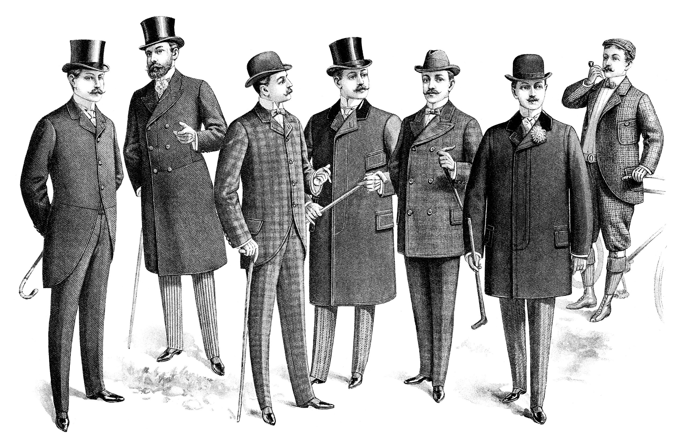
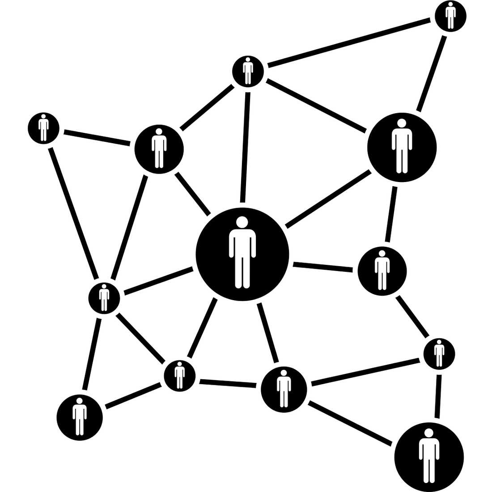

|  |
|:---:|
| via The Old Design Shop |

Yesterday, I sat down at my friend Grant’s desk to catch up a bit. He commented on my shirt and said something to the effect of ‘In 20 years, we’re going to look back and say that pattern was so ‘teens.’ Besides the insinuation that the shirt was trendy (which I would have taken as a criticism if he and I didn’t share the same style), when I walked away, the comment got me thinking about memory and how it is changing.

I’ve always had an intensely associative memory. So much so that it is rare that I will experience something new without relating it to something old. I’ve noticed a particularly pronounced link between audio and locations. I can can listen to a podcast and remember a particular run I took two years before or walk along a street for the first time in a few years and remember a conversation I was having the last time I was there. Still, it’s always been *my* memory. I’ve not had access to others’ memories, except when they’ve been recorded and in the past few years, recording has gotten a lot cheaper. The result of the proliferation of information stored and saved in this networked age has been an explosion of links and associations between people and the stories and memories.

Sidebar: Here’s an example to demonstrate how connections outpace growth of individual units: Imagine a small group of people and think about what happens when the group adds a new member. If the group starts with three people, Anne, Bill, and Charlie, and each party knows the other (so Anne knows Bill and Charlie, Bill knows Anne and Charlie, etc.), there are six relationships. When a fourth person, Doug, joins, the number of relationships increases from six to 12, and adding a fifth, Edith, makes 20. Assuming we don’t have relationships with ourselves, the number of relationships is then n*(n-1). (This growth helps to explain why social norms that can work at a small scale do not necessarily translate when the size of the group increases, e.g., a family’s dynamic is different than a nation’s. More on this later.)

|  |
|:---:|
| via GMCACanada |

It’s not just that recording moments has been getting easier for years (think the Kodak moment), but that we’ve moved beyond the individual memory. For a long time memories were personal, and even when they were shared, the potential was limited. They were trapped within photo albums, video tapes, and shoe boxes. The recording meant that memories were no longer stored in our heads, which allowed us to access many more than we ever could before, but they were still physical artifacts - heirlooms to leave to the next generation.

In this world, a collective consciousness could not emerge, at least, not as it seems to exists today. Technology provided a solution to this problem as well with new sharing solutions which allow sharing memories instantly with friends, family, and strangers around the world.

Probably more significantly than the speed of sharing is the potential reach. My audience is no longer limited to my network. When there was just one photo, I didn’t just give it to a friend to share with his or her friends. I kept it so that I could continue to enjoy it. Now that memories are largely digital, we must relinquish control over them once they are shared. It is even difficult at this point to have purely personal memories. Many of the most intimate moments are shared on the internet where they can quickly escape into the wild. We even came up with a new term to describe the phenomenon, viral. Not only can memories be shared more widely than ever before, they are also not forgotten. The inability to forget, except when told to is a defining characteristic of this new age.

Computers don’t forget and the redundancy of the web’s servers mean that unless we make a conscious  decision to "forget," I’ll be able to "remember," reliably, which shirt I was wearing on any given day because I’ll have searchable evidence. This is the environment of the collective conscious we have now. While associations can still be made at the individual level (where hearing a song reminds me of a time in my past), memories are now more entwined - I experience others’ lives as I experience my own and they experience mine.