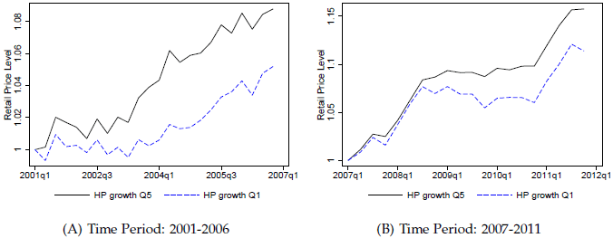

||
|:---:|
| *The left panel of Figure 1 shows that retail-price inflation was highest in locations with high housing price growth during the housing boom.  Conversely, the right panel of Figure 1 shows that the regions with the biggest declines in house prices during the housing bust experienced the lowest inflation over this time period.* |

In his article summarizing the work of Johannes Stroebel and Joseph S Vavra, "[When Housing Prices Rise, So Do Retail Prices](http://www.chicagobooth.edu/capideas/magazine/summer-2015/when-house-prices-rise-so-do-retail-prices)," Hintze writes:

> Higher home prices lead to higher household spending, according to recent academic research. But New York University's Johannes Stroebel and Chicago Booth's [Joseph S. Vavra](http://www.chicagobooth.edu/faculty/directory/v/joseph-s-vavra) argue that rising prices also lead to retail price inflation

And continues,

> Why? When house prices rise, homeowners feel wealthier and pay less attention to prices. Retailers, say the researchers, increase their markups as a result. Vavra and Stroebel see this effect only in areas with large proportions of homeowners—rising home prices don't have the same effect on renters.

While the finding is not in itself intuitive (why would an individual with no more real wealth feel that they are wealthier and therefore more willing to spend), the way the article ends appears to suggest that businesses can (and should) raise prices when housing prices rise to capture the gains and achieve a new equilibrium. This conclusion didn't feel sustainable to me. Looking only at the supply side for the moment, I would expect secondary and tertiary effects to come into play to erode any benefits:

  * Higher prices will encourage new businesses to enter the market since the profit opportunity is now larger. This will have downward pressure on the retail prices as new businesses can still make a profit event by offering a lower price;
  * The increase in competition from businesses for the attention of customers will provide upward pressure on the price of retail locations;
  * Rentiers will have an incentive to have shorter leases in an environment of increasing home prices, as that will best situate them to renegotiate rents to capture some of the new gains available from a "wealthier" population - the inverse would be true in a volatile or declining housing marketing.

Businesses, then, that are able to successfully increase price, may be able to continue to operate, but may not realize additional profits as the new competition will lower prices, and any revenue increases will eventually go to higher rents.

# Citations:
[John Hintze, "When house prices rise, so do retail prices," Capital Times, Summer 2015](http://www.chicagobooth.edu/capideas/magazine/summer-2015/when-house-prices-rise-so-do-retail-prices) [Johannes Stroebel and Joseph S. Vavra, "House Prices, Local Demand, and Retail Prices," Working paper, April 2015.](http://www.nber.org/papers/w20710)