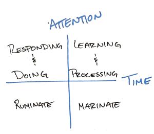

Think about the last time you were in an elevator. Did you pull out your phone to check your email or get an update on the score of the game? How many people were playing with theirs? Adjusting the song they were listening to as they rocked out in a world of their own or responded to a text from a friend? We are constantly faced with opportunities to engage in different activities, but how we do (or should) choose is less clear.

I've found that many of my behaviors have become habitual that I almost don't notice them. This became painfully obvious for me when I realized that I had the habit of pulling my phone out to check my emails even on short rides - like the four-story ride to the lobby of our apartment. I'm lucky if my email is even fully loaded before the doors to the elevator open and I'm on my way.

Thinking that there had to be a better way to spend the time in the elevator (and all of the other micro-spaces between events), I started breaking down my activities across time and the amount of attention required. This exercise yielded the matrix above and has been helpful in identifying ways I can optimize my behavior. The four buckets are: learning & processing, responding & doing, ruminating, and marinading.1

Keeping this matrix in mind, I have been able to revamp how I spend my time and use this as a heuristic for what's an appropriate use of time.

Emails can be a tricky proposition. Most of the time the sender will tell you whether any action is necessary or if reading it will be helpful to allow you to marinate an idea during the course of the day. Sending a quick response to your boss to let her know that you're on top of the project. Reading the note from your colleague asking for help on a tricky problem.

While these could be helpful, I've effectively given up on reading my emails on elevators. I just don't get enough out of the experience and instead focus on doing nothing in that small window - giving my mind a moment to breathe. A hidden benefit here has been that I've found myself reading fewer emails multiple times (I used to read them but not be in a place where I could respond and then had to re-read them later to remind myself what was in the note).

# Descriptions
Hopefully the different categories are fairly intuitive, however, I have written out short descriptions of each in case that will help you think about where / when you might apply them.

## Learning & Processing
To really understand material, most people require both time and attention to fully internalize the concept, often over days or weeks for more complicated problems and topics. In her book [Mindset](http://www.goodreads.com/book/show/40745.Mindset), Carol Dweck refers to how nearly everyone at one point did **not** know how to multiply and now they do. While multiplication continues to be a favorite reminder for me of our ability to grow and learn, it also demonstrates how when we were learning to multiple 2x3, we needed to be able to focus and think. When we were staring, we needed to count the two rows of three jelly beans to get our six total jelly beans (mmmm, I love jelly beans). Now, because we've done it so many times, 6 is practically tied to 2x3 in our minds - what Barbara Oakley would call a Chunk.

## Responding & Doing
Responding and doing is similar to applying knowledge or skills. While not learning something new, if the problem is involved or new enough, it will require attention. The responding and doing is the attention required to write a coherent response to your boss's email or your friends text. While writing is a skill you may have mastered a long time ago, if you try and write while you're having a conversation with someone, chances are words you say or hear are going to wind up in your writing.

## Ruminating
Ruminating and marinading may feel similar (they are), but for my purposes, ruminating is the short bursts version of marinading. Ruminating is when you allow your mind the freedom to make jumps between thoughts. You may be thinking about the design of the elevator (like why the north elevator has the buttons to the right of the doors while the south elevator has the buttons to the left) when your mind jumps to building design, and then city planning, and then taxes, and then the governor's latest faux pas. Ruminating is particularly useful when you only have a few minutes - hardly enough time to dedicate to doing something you'd be proud of - and want to generate some new ideas.

## Marinading
Marinading, in contrast to ruminating, is what you do when you get stuck on a problem. Though you'll likely come up with new and unexpected ideas while allowing an idea to marinade, it's much more passive. The thoughts are in the background and can go on throughout the day. It's like an idea you want to let sit and soak up any new thoughts that come by for testing later. Marinading is the part of your processing where you allow new ideas to inject life into a problem by walking away from the problem itself.