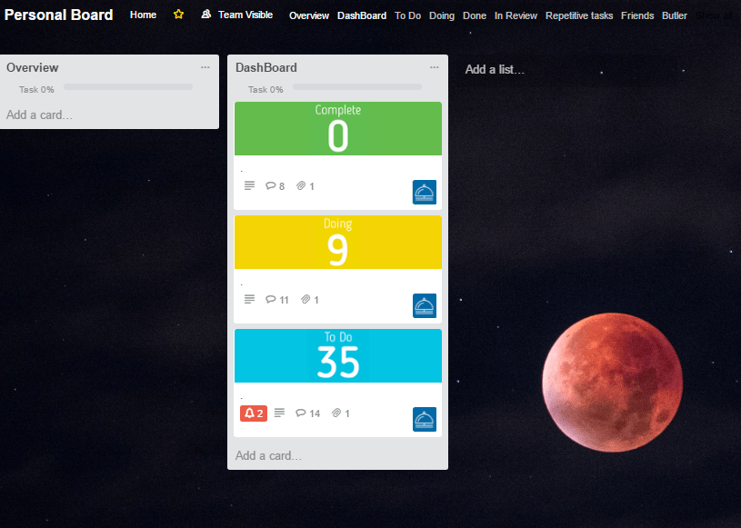

Last night, I made a small change that made a big difference. It didn't feel significant when I made it. It felt like a thing you do when you're bored. I changed the background of my [Trello ](https://trello.com/)board.

For this to make sense, it's worth understanding that I spend more time on Trello than any other service. I nearly *always* have my boards open, including my personal board. As I'm getting nearer to my wedding, this means that I have more things to do personally (check in with the caterer, finalize seating arrangements, etc.) than usual.

Due to a recent partnership with Unsplash (another favorite service), Trello boards can not access a huge archive of professional grade photos.

I started with a stark photo of the moon. It was beautiful, majestic, and stunning. It was also quite dark. Against a night sky, the moon, though a focal point, hardly dominated the frame. This left a lot of black on my screen.

A dark color palette has it's place. For example, I use a dark theme to write in [emacs](https://www.gnu.org/software/emacs/). It's easier on the eyes and keeps me more focused. But in Trello, where I'm trying to get the energy to tackle hard (and some not so hard) projects, black was depressing.

On a whim, I was looking for a change and came across one of my favorite photos I've found on Unsplash - an aerial photo of a beach by [Matthew Kane](https://unsplash.com/@matthewkane).

Maybe it's because it's summer, or because I'm going to a beach soon, or maybe it's just the pleasing blend of pastels, but the photo makes me smile. It's a reminder of motion and constant change. I find it inspiring and utterly relaxing.

I didn't appreciate what it meant to change until I returned to Trello today. My list, which is longer than its ever been, wasn't intimidating. The beach calmed me and I started crossing things off with a smile.

Little changes can make a big difference. It's so easy to accept your work space for what it is and believe that there's nothing you can do to change that. Changing my background is hardly revolutionary, but not only did it change my mindset while I'm working, but also of what I could do to affect my mood.

Not bad for a whim.