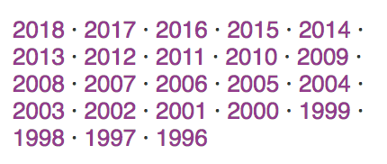

The next best time is now. I've been dying to get back to this blog for months but this week two things gave me the push I needed:

  1. First was finding [Martin Fowler's blog](https://martinfowler.com/) and specifically seeing his tags.  For those counting at home, that's 22 years of blogging. Whenever I see a log like this I feel a tinge of sadness. Then I remind myself of the quote I used to title this post.

  2. Des Traynor was recently on the Indie Hackers podcast discussing Intercom's development. It's great listen and Des delivers nugget after nugget. [The Path from Minimum Viable Product to $50M a Year with Des Traynor of Intercom - The Indie Hackers Podcast](https://www.indiehackers.com/podcast/064-des-traynor-of-intercom)

In talking about the importance of managing a firm's brand, Des talks about how they used their blog in pursuit of their mission to make business personal.

Together those were the nudges I needed.

# Why I'm back

I've been tossing around the idea of a career shift for several years, but this summer I finally took the plunge to pursue it full time. I wish I could go back to '95 and tell my younger self to think more seriously about computers.

I missed that chance to plant that seed, so here I am trying to catch up. I do not have the hours at the keyboard that a programmer my age normally would or could if they started earlier, but I have several years of experience in learning how to learn. I fully intend to catch up to my peers and contribute as an equal member in short order.

In order to do that though, I have a lot to learn. That's where this blog and site come in.

# What you can expect

I'll continue to explore topics like Made Time, but I won't limit myself to self-improvement. There are too many resources out there for that and I have too many interests. So, in addition to figuring out ways to work smarter, I'll be tracking resources I find helpful, new concepts I've learned, and exploring ideas through my writing.

Frankly, from an editorial perspective and publication side, I don't know what this will look like yet, but at a minimum, I plan on publishing learnings of the week every Sunday.

# Bottom line

I wish I'd started 20 years ago. I would be in a much better position today if I had. Unfortunately, until time travel becomes possible, I'll have to resolve to be better now. Better means a greater focus on the things that will really push me forward (98% chance that I'll be wrong on what those things _are_, so feel free to nudge me toward better decisions).