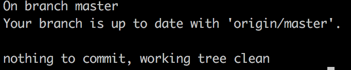

I've been trying to learn more about Git recently. I thought I'd write up some of the lessons I've learned to create a basic primer on Git, why it's useful, and how it can be used. 

# What is Git

Git is a distributed version control system.

It works by tracking changes *within* files that are located within a repository.

I have yet to find a meaningful difference between a repository and a directory or folder. So, when thinking of a repository, I think of it as a master file in a file cabinet. Within it, I can have loose files or sub folders. Changes to any file - whether loose or held within a sub folder will be tracked by Git.

If you’re like me and you’re coming from an office environment where you have sent Word documents or Excel models back and forth, Git addresses the issue of version control. No more `_v2_sw_edits`. Hooray! 

# Why Git

Git is not the only version control system (VCS) or DVCS (the D is for distributed) solution out there, but it is the most popular.

This made it a natural choice when choosing which one to learn first -- particularly because while the syntax will change, and each system will have nuances, the principles of GIT will be shared among the different VCS solutions. 

# Git Commands

The git commands that I have found most useful when working on my own projects are `init`, `add`, `status`, `commit`, `log`, and `push` All of these commands are used within Terminal (or a command line interface replacement, like iTerm2). 

## Init

If making a new repo locally, you will want to initialize the Git tracking using `$ git init`. To do this, you navigate to the directory that you will want to track using Git in Terminal, and then execute the command. 

## Add

If a file is modified inside of a repository - Git will track any changes to it. But until a file has been committed, it is only saved locally and not part of the version history. This means that before you can take advantage of the version control that Git provides, you need to add it to a queue for committing. The `$ git add [file]` command will put the file into the queue. For example, `$ git add workingFile.js` will add the JavaScript file workingFile to the queue if the directory is tracked by Git. If you want to add all files in a directory, you can use the special command `$ git add .`

## Status

Unlike the add command, status does not require any other inputs. Instead, it provides the status of the directory you’re currently in. To see the status of a file, we use the `$ git status` command. The different statuses I’ve found are: 

1. Modified <\-- this is when you have made changes to a file since the last time it was committed 
2. Untracked <\-- a new file has been added to the repository that has not been committed yet 
3. Up to date <\-- this file has not changed since the last commit.



## Commit

When you’ve made a change to a file in your program and you’re ready to save it, you use the commit. Until it’s committed, any changes made are not tracked within Git, so you’re susceptible to losing your work.

Each commit requires a comment to describe the change. This is a great excuse to make commits bite-size, because you want the comment to describe all of the changes made to the file so that if you have to go back, you don’t lose work and/or know what you’re losing.

I have adopted a rule-of-thumb which results in fairly frequent and small commits - in practice every 10-20 minutes of coding I’ll make another commit because that’s the period of time to figure out what I want to do, read through the code, make a plan for how to do it, make the change, and then test that it did what I wanted it to do.

**Implicit in this is that I *try* to only commit working code. Particularly when working on shared repos, this is best practice.**

The command `$ git commit` will commit all files that have been previously added to the queue using the `git add` command.

There’s an optional label `-m` which will allow you to put a comment directly in line with the commit. If you use this, understand that the comment applies to all files added in that commit. If you don’t remember what’s in your commit (i.e. what’s been added), it may be better to leave this off and use the Vim editor to see all of the files included in the commit.

### Side note
If you do not use the `-m` option, iTerm will open a Vim editor which has it’s own commands which took me a while to figure out. Once the comments are added, use the keystrokes `Esc`+`:x` to save the file (and make the commit). 

## Log

Commits are fine, but they’re only really useful because Git will track all of those changes in a log. That’s where Git really shines, because it can show you a log of all of the changes you’ve made using `$ git log`. 

## Revert vs Reset

Revert will reverse the changes from a commitment and is used mostly to undo faulty commits. This means that you can revert specific commits without affecting others. Revert works by making a new commit with the changes removed. You can revert any past commit. This can be the last commit, `$ git revert HEAD`.

Or `$ git revert -n master~5..master~2` which will revert the changes done by commits from the fifth last commit in master (included) to the third last commit in master (included), but do not create any commit with the reverted changes. The revert only modifies the working tree and the index. This example came from https://git-scm.com/docs/git-revert and helps show the different options associated with reverting. 

Reset, in contrast to Revert, does not create a new commit, but effectively goes back in time to a state in the past and calls that current. This is really helpful if you need to take a new direction in your work and don’t mind discarding the latest commits. 

There are a number of options to customize this approach, but the simplest is `$ git reset —-hard [<commit>]` which will discard all changes between the current HEAD and the commit indicated in the command. It’s worth noting that the commit is specified by the Index, which is the number you see when you call the log. 

# Branch
The branch is one of those areas that you don’t think you need until you have it. Then you wonder how you lived without it. It’s also an example of one of those areas where Git differs pretty strongly from other VCS systems by making branching cheap and (relatively) easy.

Branching gives you a flexibility to experiment and try to build new features without taking down the original program.

When you create a branch, it’s similar to creating an alternate universe. In the branch, you can edit, tweak, and modify the program in any way you see fit.

This enables experimentation without affecting the core product. Ultimately, if those experiments are successful, you’ll want to bring them back into the `master` branch.

To create a branch, use the `$ git checkout -b [branch name]` command. 

This is short hand for:
  ```
  $ git branch [branch name]
  $ git checkout [branch name]
  ```

When you’re done with a branch, you can delete it with: `$ git branch -d [branch name]`.

# Merging & Rebasing

Merging and Rebasing are two approaches for combining a branch into the master.

Rebasing provides a much simpler, cleaner story by consolidating all of the commitments into a linear stream - however, it’s not recommended if the repository is shared.

If the branch is local and personal, rebasing can make understanding the evolution of the program simpler. In other cases, it’s easier to collaborate with merging.

# Git Aliases / Config
One of the things that has helped me move more quickly with Git is the use of aliases by modifying the ~/.gitconfig file in my home directory.

This has allowed me to create aliases for commands like git add to be just ga.

It’s most helpful on even longer commands that you repeat frequently, such as the git log which can have multiple decorations.

My .gitconfig file has the following short cuts:
```
[alias]
  co = checkout
  ci = commit
  st = status
  br = branch
  hist = log --pretty=format:'%h %ad | %s%d [%an]' --graph --date=short
  type = cat-file -t
  dump = cat-file -p
```

Since these are all in my .gitconfig file, they need to be proceeded by `$ git` to access.

For example, if I wanted to commit a file, it would be `$ git ci`.

# Sources

1. [GitImmersion](http://gitimmersion.com/) – This tutorial gave me a great starting point to understand how I can use Git.
2. [Pro Git](https://git-scm.com/book/en/v2) – Literally the book on Git, this is a phenomenal resource, but it’s long, so I’m making my way through it slowly.
3. The [Git](https://git-scm.com/) website – if the book’s too much, or I’m looking for something specific related to Git, this is where I go.