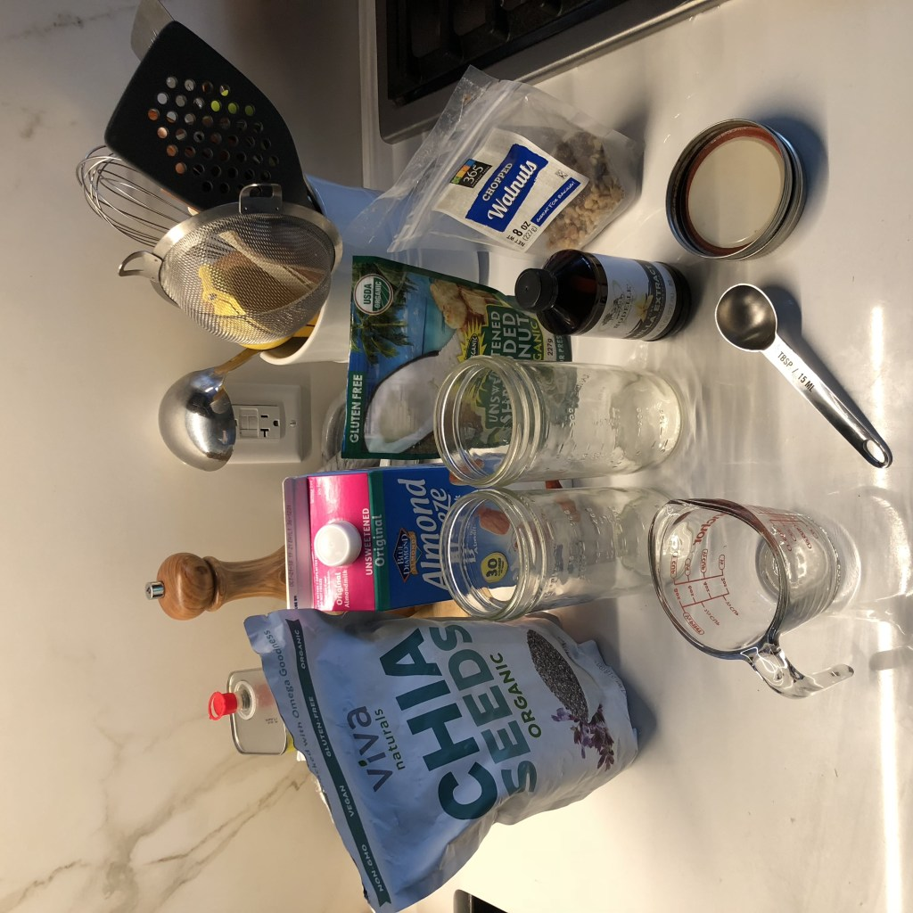
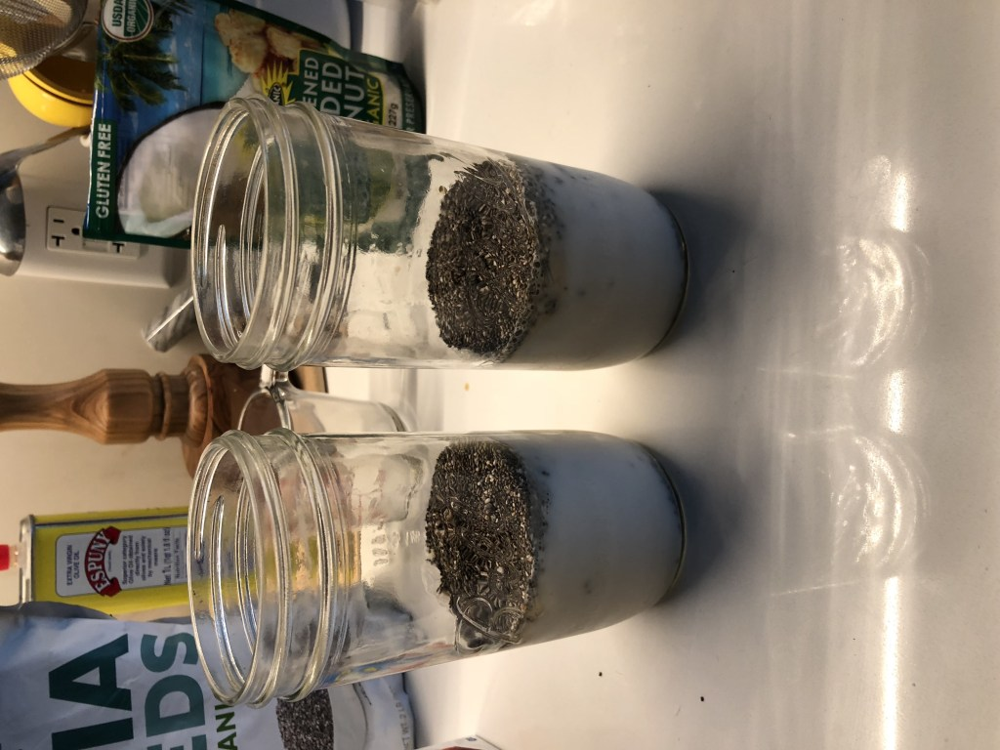
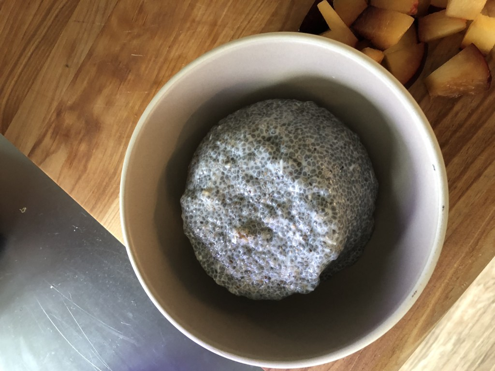

At brunch with my cousin, I tried Chia Seed Pudding for the first time. It was awesome. To me it was a pleasant combination of Oatmeal and a yogurt fruit bowl.

Importantly, Chia Seed pudding *felt* like something I could make at home. To get myself started, I went searching for a recipe and found Eating Bird Food's [Basic Chia Seed Pudding](https://www.eatingbirdfood.com/basic-chia-seed-pudding/). Either I read the recipe wrong (likely) or the proportions weren't quite what I was looking for. My first attempt came out so soupy I could have gulped it down.

To improve the recipe, I've started almost doubling the chia seeds to get the consistency that I like.

It's worth noting that this new version packs a lot of calories and fiber into a morning.1 TSP of chia seeds has ~4g of fiber. I'm also not making this pudding because I think it's healthy. It may or may not be. That's beside my point.

I was looking for something that's filling, easy to prepare, and flexible. Chia seed pudding checks all of those boxes.

With that caveat, here's the recipe that I've been using:

# Ingredients

* 5 Tablespoons chia seeds
* 1 cups unsweetened almond milk
* 1/2 teaspoon vanilla extract 1 drizzle honey
* 1 pinch of coconut shavings
* 1 small handful of walnuts
* 3 dates
* 1 nectarine / peach
* 1 banana

# Instructions
1. In a mason jar, mix together chia seeds, almond milk, vanilla, honey, coconut shavings, and walnuts. With the lid on, give the jar a good shake.
2. Place the mixture in the fridge upside down and let it set.
3. After 5 minutes (or up to an hour later), return to it and give it another good shake and flip it right side up.
4. At this point you can either jump ahead to adding your fixings or let it set overnight.
5. When you're ready to add the dates, nectarine/peach and banana, slice the fruit, add it the pudding, stir.
Enjoy

