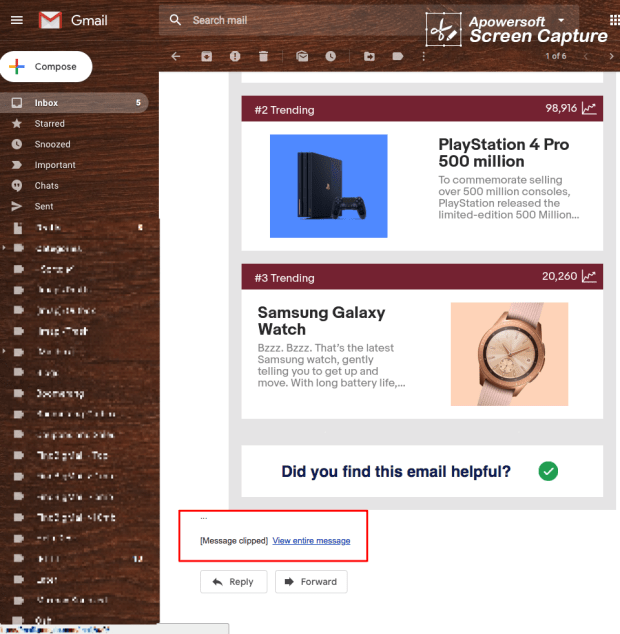
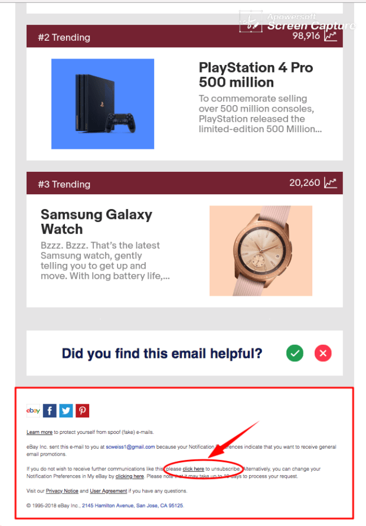

Want to make sure that your customers unsubscribe _even less_ than they would otherwise? Make your email long enough so that only the footer gets clipped. Not sure how long that is? Ask eBay. Here's the email in gmail.

| |
|:---:|
| *eBay's recent promotional email* |

And here it is when I view the entire message. Only the footer was clipped.

|  |
|:---:|
| *The same email, this time seen in full* |