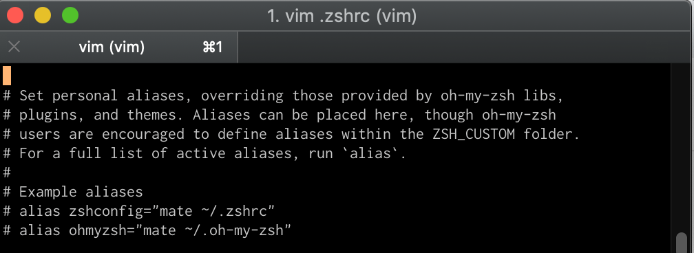
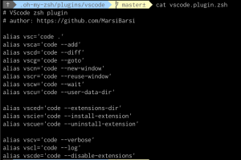
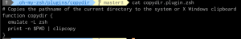

**NB: If you want the quick steps to add aliases to your `zsh`, jump down to the section, "[Adding Aliases: The Better Way](#adding-an-alias-the-better-way)".**

First, a little backstory: I’m a big fan of aliases. In fact, when I was learning how to use terminal, they were one of the first things I set up for myself and they changed the way I used git. Every command was so much easier to navigate that I never felt a need to stray away from the command line.

When I decided to move to `zsh`, one of the first things I wanted to do was configure my aliases. `oh-my-zsh` comes with a whole suite of aliases, which are viewable through the `alias` command. There are some great defaults, particularly for navigation and `git`.


Still, I had a few navigation aliases I wanted to add.

## Adding An Alias: The Easy Way

In hunting for *how* to add an alias, my first Google search suggested using the `alias` command. This was straightforward and seemed to work well enough for a while.

`$ alias up=‘cd ..’`


Woot! It worked!

Then, I’d close the close the terminal and come back and I’d get an error: `zsh: command not found: up`.

What the heck?! Sure enough, when I searched through the aliases (using the `alias` command) `up` wasn't there.

### Finding The Problem
When I was adding aliases to bash, I would do so by saving them to the `.bash_profile` file (I hear you can also use the `bashrc` file). It made sense to me then that the aliases I was adding would wind up in the ZSH equivalent - so, I opened `.zshrc` to take a look.

If you're an `oh-my-zsh` user, you may see the following in your config file:



A couple of things struck me about this message:
  1. My aliases, as well as all of the others I saw when I ran `alias`, were *not* listed there
  2. While it seemed like I *could* put my aliases there, `oh-my-zsh` encouraged saving them in the `ZSH_CUSTOM` folder

To find `ZSH_CUSTOM`, I used the echo command: `echo $ZSH_CUSTOM`.


And just like that, I knew where I needed to look around.

What I found by navigating through the `oh-my-zsh` directory was that plugins, themes, etc., were all stored in files with extension `.zsh`.





The ZSH shell then was looking through this file to find all of the aliases that were defined and giving me access to them. Armed with a better understanding of *how* `oh-my-zsh` was finding aliases and functions to access from the ZSH shell, I could now (more) comfortably add my own.

## Adding An Alias: The Better Way

The steps to adding aliases for `oh-my-zsh` is as easy as reading the instructions embedded in the docs provided. But, if you're like me and they weren't immediately clear, here are the five steps you'll need:

  1. Go to the folder `$ cd ~/.oh-my-zsh/custom`
  2. Create a new `.zsh` file. You can name it what ever you'd like, but for testing, I created `aliases.zsh`
  3. Add you new aliases to your new file. You can do this by opening the file with your preferred text editor. Here's what mine looked like

```bash
#An alias to naviage up one directory level
alias up='cd ..'
```
  4. Save and quit the editor
  5. Restart your terminal *or* use `$ source ~/.zshrc`

**Voila!** Your new custom aliases will now be available!

### Time Saving Ideas

Looking for inspiration? Check out this thread for a list of great time-saving aliases in bash/zsh:

* [Ask HN: Share your favourite bash/zsh aliases](https://news.ycombinator.com/item?id=9869231)