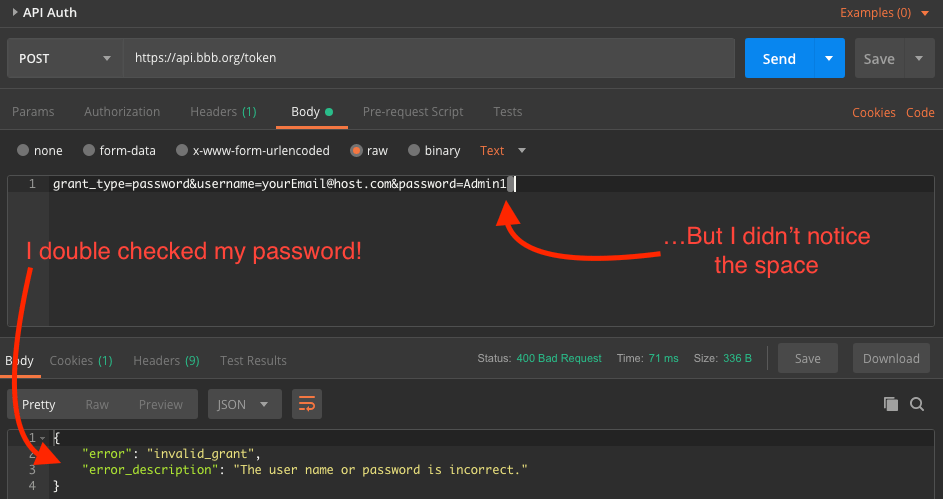

Occam was a 14th century theologian-philosopher who is perhaps best known now for his relentless insistence on using the law of parsimony. Also known as, 'Keep it simple, stupid.'

This is a story where remembering Occam would have come in handy. Instead, I searched high and low for an explanation other than user error.

Want to jump to the end? The moral of the story is that if you’re using a `content-type` of `application/x-www-form-urlencoded` in an API call, be sure to check for extra spaces or new line characters in the body. Leaving them in creates problems. 

# Background And How I Initially Suspected URI Encoding
I use a password manager to create unique passwords for almost every service I use. This greatly simplifies my life without the mental tax of having to remember all of my passwords or reusing passwords across many services. It also means I copy and paste a lot of passwords.

When I signed up to explore the Better Business Bureau’s API recently, that’s exactly what I did. I went to my password manager and asked, "Please, oh please, generate a password I could never remember and which I never want to type!"

Poof. It did its magic and produced a 20+ character password complete with uppercase and lowercase characters, as well as fun special ones like `#`, `$`, and `*`! 

Now, according to the instructions, all I had to do was send a POST request to get my authentication.

| |
|:---:|
| *Authentication instructions* |

I opened up Postman and prepared for success! 

After setting the header, I moved onto the Body and followed the instructions (almost) exactly! But as my screen shot below demonstrates, I left in either a space at the end of the line or a newline character. It turns out - that makes a difference. That’s when I started getting `400 Bad Request` errors.

Instead of starting fresh and typing in my password one character at a time, I *changed* my password. I changed it to something really simple. It was `Passw0rd` (I needed a capital and a digit). It pained me, but I wanted to control different variables and figure out where I was going astray. Once I updated my password, I received my first `200 OK` response along with an access_token!

That proved it! The problem was the password! But why? 

## Let The Search For Answers Begin
I started hunting around for what was different between my new password and my old one. I of course didn’t notice the trailing space and/or think that it could *possibly* be the cause of all my frustration. So, I created a much more complicated theory. I found that URI encoding / decoding has reserved characters. Characters *like* `#`, `$`, and `*`.

So, I laid the blame at the feet of the team which chose to allow these special characters in their passwords when they had the potential to create so much frustration. 

## Disproving A Bad Theory
It was only when I started writing about this experience (initially with the warning to not use reserved characters if you had to encode them) that I figured out that wasn’t the problem.

Here’s proof that the URL encoding can go both directions. Using [Dan’s Tools URL Encode/Decode](https://www.url-encode-decode.com/) (the same site that initially provided fodder for my half-baked theory), I decided to test.

|  |
|:---:|
| Two way URL Encoding |

If the encoding/decoding process was the culprit, I would not be able to encode a password with reserved characters and then get the same thing back. That, however, is *exactly* what I was able to do. I started by encoding `A*D(S$#dasf1859`. This returns `A%2AD%28S%24%23dasf1859`. I then decode *both* and get `A*D(S$#dasf1859` for both lines. 

Voila. Bad theory banished. 

# Conclusion

It’s much easier to point the finger elsewhere when things don’t go quite right. Oftentimes, however, the answer is the simplest one. Yet another reason to never forget [Occam](https://www.merriam-webster.com/dictionary/Occam's%20razor) or the [KISS principle](https://en.wikipedia.org/wiki/KISS_principle).