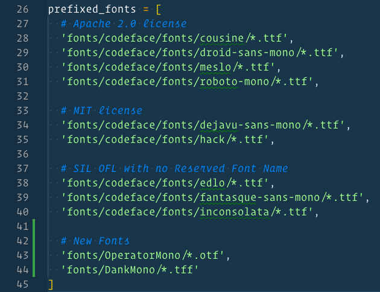

A few months ago, I found a font, `fira code` that introduced me to ligatures and how they could be useful in writing code.

|   |
| :------------------------: |
| _Fira Code’s ligature set_ |

`Fira code` is awesome and honestly, I was really happy with it. But, I got greedy and wanted to combine it with a font that included cursive so that I could combine the two.

If you’ve ever watched a Wes Bos video, you’ve likely seen Operator Mono. It’s a beautiful font. But, it doesn’t have ligatures. So, even if I wanted to use it, I’d be frustrated.

Google searches on using ligatures and cursive fonts will yield multiple results - such as [this](https://medium.com/@zamamohammed/multiple-fonts-alternative-to-operator-mono-in-vscode-7745b52120a0) article by Mohammed Zama Khan.

Mohammed’s solution, however, was to use two fonts - `Fira Code` and `Fira Flott` and then reference a custom CSS file within his VSCode `settings.json`. His settings appear to make `Fira Code` the default, and then inject `Fira Flott` in specific situations.

This works (he proved it and I tested it), but I wanted to go the _other_ way and have a default cursive font, and add ligatures _to_ it.

My search ended up sending me to the [Ligaturizer](https://github.com/ToxicFrog/Ligaturizer), a tool built in python to add ligatures to any font.

# Ligatures: What Are They And Why Do They Matter?

Before we get into _how_ to use Ligaturizer (spoiler alert: the Readme is incredibly helpful), let’s talk about why.

Ligatures are symbols that appear when two (or more) characters appear in sequence that is different than how those characters would appear if printed independently.


(https://upload.wikimedia.org/wikipedia/commons/5/56/The_Wheel_Taumfel.jpg)

As an example, this example from Wikipedia shows how the `Th` and `Wh` combine in unique ways when next to one another.

Ligatures draw your attention to specific parts of text because they’re different. This can aid in readability. In the case of `The wheel` above, the ligatures provide a more fluid experience.

Using ligatures in writing code can provide a similar benefit. Taking a Javascript example, imagine that you want to evaluate for strict equivalence instead of loose equivalence.

When you have hundreds of lines of code, ensuring you wrote `===` and not `==` is harder than seeing the difference between a long three bars and a short two bars.

Ligatures visually inform intent.

# Running Ligaturizer

Once you download Ligaturizer and open it up, you’ll notice that there are several fonts already present for you to test.

## Configuring Ligaturizer

The first thing to do is add the fonts you want to the `fonts` directory.


In my case, I’m adding both `DankMono` and `OperatorMono`.

Once that’s done, open up `.build.py` in your text editor and add the new fonts. Before running `make`, I ended up commenting out rows 27-40, however, it’s not strictly necessary.



Optionally, at this point, you can go into the `ligatures.py` file and disable any of the ligatures you do _not_ want added to the fonts.

Ligaturizer comes with ~600 different ligatures, so there’s plenty of customization available. I took a cursory look and decided to stick with the defaults.

## Make Your Fonts

Now, you’re ready to run the program and make your fonts.


Ligaturizer requires python and `fontforge`. (If you don’t have it, look at the Readme to see how to get it. On Mac it’s as easy as `brew install fontforge`).

## Add Font to FontBook

Assuming you follow the instructions, however, after the application runs, you’ll have a suite of new font files in your `output` directory.

At this point, you have a new font that you can use just like any other. If you’re on a Mac, that means you can import the files into your Font Book and then reference them in your VSCode settings.

# My VSCode Settings

Note: When I did this, though my files _had_ a prefix, when I loaded them into FontBook, they were folded into the same font family. To address this, I ended up removing the whole font family and then reimporting _just_ the ligatur-ized files.

Now that I have a font that has both cursive (for italics) and ligatures, I needed to configure VSCode appropriately.

Here are the custom settings I’ve added to get the effects I was looking for.

```json
{
  "editor.fontFamily": "'Operator Mono', Menlo, Monaco, 'Courier New', monospace",
  "editor.fontLigatures": true,
  "editor.tokenColorCustomizations": {
    "textMateRules": [
      {
        "scope": [
			// following will use italics
          "comment",
          "entity.name.type.class", //class names
          "entity.name.type.js", // new … Expression
          "constant", //String, Number, Boolean…, this, super
          "keyword", //import, export, return…
          "support.class.builtin.js", //String, Number, Boolean…, this, super
          "storage.modifier", //static keyword
          "storage.type.class.js", //class keyword
          "storage.modifier", //static keyword
          "storage.type.class.js", //class keyword
          "storage.type.function.js", // function keyword
          "storage.type.js", // Variable declarations
          "keyword.control.import.js", // Imports
          "keyword.control.from.js", // From-Keyword
          "keyword.control.flow.js", // await
          "keyword.control.conditional.js", // if
          "keyword.control.loop.js", // for
          "keyword.operator.new.js", // new
        ],
        "settings": {
          "fontStyle": "italic"
        }
      },
      {
        "scope": [
          //following will be excluded from italics (VSCode has some defaults for italics)
          "invalid",
          "keyword.operator",
          "constant.numeric.css",
          "keyword.other.unit.px.css",
          "constant.numeric.decimal.js",
          "constant.numeric.json",
          "constant.numeric.css",
        ],
        "settings": {
          "fontStyle": ""
        }
      }
    ]
  }
```

# Sources

For more information, start here:

- [MS: Syntax Highlighting Optimizations](https://code.visualstudio.com/blogs/2017/02/08/syntax-highlighting-optimizations)
- [StackOverflow: Display italics in formatted code](https://stackoverflow.com/questions/41320848/how-do-i-get-visual-studio-code-to-display-italic-fonts-in-formatted-code)
- [Custom Style Sheet with Fira Code and Fira Flott](https://gist.github.com/neetjn/3a132938e166f40e81cbb9a96db96cf8)
- [Reddit: Combining Fonts in VSCode](https://www.reddit.com/r/vscode/comments/8e4sat/how_can_i_combine_2_fonts_in_vscode/)
- [Wikipedia: Ligatures](https://en.wikipedia.org/wiki/Typographic_ligature)

# Tools

- [LIgaturizer](https://github.com/ToxicFrog/Ligaturizer)
