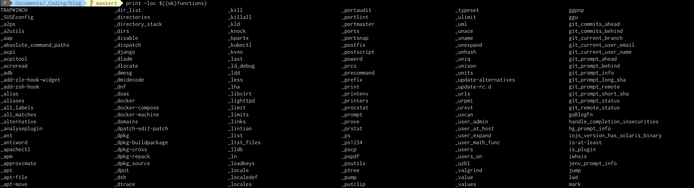
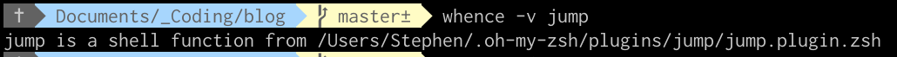

I recently figured out how to write a shell function. The problem is that pretty quickly I'd forgotten *which* functions I'd written, or fi I had a general name, I couldn't remember what they did exactly.

So, I wanted to figure out a few things:
1. Figure out *which* functions are defined
2. Figure out *where* a single function is defined
3. Figure out *what* the function definition is

This is where using Print and Whence came in handy.

# What Are Available Functions?
We can use the print built-in: `print -loc ${(ok)functions}` (note, `l` is new line separated, `o` is ascending ordering, and `c` makes columns).

# Where Is The Function Defined?
Figuring out *where* a function is defined can be done with `whence -v [function]`. This is useful if you want to modify a function definition.

# What Is The Function Definition?
Before going in and changing a function definition, however, you may want to know *what* the function actually does.
The `whence` builtin is one way to accomplish this with the `-c` and the `-f` options.

According to the [manual](http://zsh.sourceforge.net/Doc/Release/Shell-Builtin-Commands.html):
* the `c` option prints “the results in a*csh*-like format. This takes precedence over-v.”
* The `f` option “causes the contents of a shell function to be displayed, which would otherwise not happen unless the -c flag were used.”

The commands would look like `whence -c [function]` or `whence -f [function]`.

It's worth noting that the [Stackoverflow conversation](https://stackoverflow.com/questions/11478673/how-to-show-zsh-function-definition-like-bash-type-myfunc) on the topic notes several other approaches, however, `whence` performed accomplished my use case nicely and I didn't feel the need to explore much further at this time.