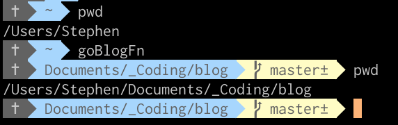

# Imagination Time
Imagine a situation where you want to be able to navigate to a specific directory then open that directory with your text editor.

That’s the situation I find myself in with many of my projects.

In the past I would create an alias that either navigated to the directory ~or~ opened it up as a workspace VSCode (my default text editor).

These solutions are fine, but they leave a few things to be desired in that:
1. If I only navigate, I now have to type a second command in my shell to open it, ~or~
2. I open it in one fell swoop, but if I wasn’t already *in* the directory, then navigating around it can take time as I have to `cd` my way to it.

In the spirit of doing things more efficiently, I wondered if there was a way to combine these steps. It turns out there isn’t just one.

# Shell Aliases and Functions
Two common ways to speed up your shell work is through the use of aliases and functions (a recent discovery).

Rule of thumb from [simont](https://stackoverflow.com/users/1084945/simont) on StackOverflow:
> For readability, I’d personally go for a function for anything that’s semi-complex.

Let’s talk about how we could use both to accomplish our hypothetical example.

## Alias Approach
I wrote an [introduction to aliases](https://www.stephencharlesweiss.com/2018-09-05/aliases-and-the-bash_profile/) in bash previously, but only recently discovered that aliases can be chained together using a semi-colon (`;`).

So, in our alias file (which may be a `.bashrc`, `.zshrc`, or, if you’re like me and use `oh-my-zsh`, it’s `~/.oh-my-zsh/custom/aliases.zsh`) let’s create the alias for `goBlog` - a single command to navigate to the directory and open up the blog contents in a text editor: `alias goBlog='cd ~/blog; code .'`

Breaking this down:
* `alias` indicates that what follows *is* an alias
* `goBlog` is how we will invoke the command, i.e. it is the alias for the subsequent command
* `=` notice that there’s no space between the alias and the string for the command — I am not convinced this is a rule, yet I have not gotten it to work with spaces, so YMMV.
* `cd ~/blog;` is a change directory command to navigate to where I store my blog locally
* `;` means that the command is complete (just like a terminator for SQL)
* `code .` uses a symlink that I configured for VSCode to open the current directory (`.`). The configuration for the symlink is stored in my `.bash_profile` as:
``` vim
# // .bash_profile
# Setting Path for VSCode (code)
Path="/\$PATH:/Applications/Visual Studio Code.app/Contents/Resources/app/bin"
```

I now have an alias that accomplishes my goal of combining both steps.

## Function Approach
How would this work with a function? Turns out, it’s much easier and less intimidating than I thought!
Using the exact same commands above, we define a named function, `goBlogFn`, which can be invoked by calling it in the shell.
```vim
goBlogFn(){
  cd ~/blog
  code .
}
```

Seeing this in action:



(Note: the directory is slightly different from the example, but principles apply)

## Don’t Forget To Reload
Once you’ve saved / modified your aliases / functions, before they’re accessible you need to reload.

The most straightforward way to do this is to close and re-open your shell.

I also created an alias for the process: `alias zshReload='source ~/.zshrc'`

# Additional Resources
[customization - Oh My Zsh multiple commands with one alias - Stack Overflow](https://stackoverflow.com/questions/19255030/oh-my-zsh-multiple-commands-with-one-alias/19264761#19264761)
