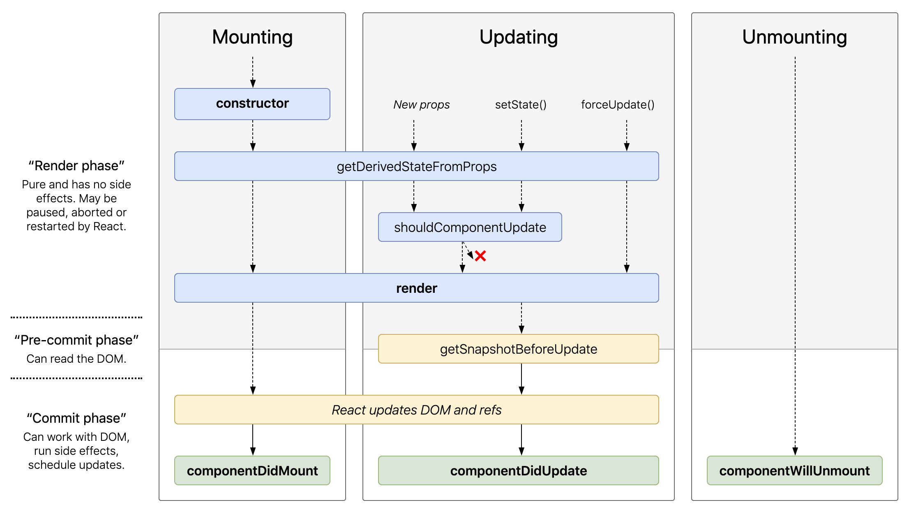

One of the things that I didn’t appreciate when I first started using React was how helpful the different lifecycle methods were. I got away with it for a while by working on simpler projects that could get away with just using a `constructor`, `render`, and sometimes `componentDidMount` if I was getting _crazy_.

I knew that there was more out there, however, I didn’t have a great framework for thinking about it. While React has great documentation on the lifecycle methods - I couldn’t put them in context. Scott Domes’ articles were really helpful in this regard - particularly his [update on lifecycles for React 16](https://blog.bitsrc.io/react-16-lifecycle-methods-how-and-when-to-use-them-f4ad31fb2282) .

To appreciate _why_ lifecycle methods are different, more special than, other methods - look no further than the React docs:

> Each component has several "lifecycle methods" that you can override to run code at particular times in the process.

Let’s break that down:
"Each component has several ‘lifecycle methods’" means that React will be looking for these methods at different stages in the building, updating, and tearing down a component on the DOM.

"…that you can override" means that when you define them in your component, you’re telling React what to do when we get to that stage. Think about a `render` method. By defining `render`, we describe _what_ we want to render — React manages the _when_.

"…at particular times in the process" refers to the different stages of the life cycle, of which there are four: Mounting, Updating, Unmounting, and Error Handling.

So, by defining the different methods in our component, we can tell React what we want to do at certain points.

A few things to keep in mind:

- Before render, we do not have access to the DOM and therefore any DOM manipulation should be avoided. For example, using an AJAX request to retrieve data to display on the page should happen _after_ mounting. As Tyler McGinnis explains:
  > You can’t guarantee the AJAX request won’t revolve before the component mounts. If it did [resolve before], that would mean that you’d be trying to setState on an unmounted component, which not only won’t work, but React will yell at you for. Doing AJAX in componentDidMount will guarantee that there’s a component to update.
- Some lifecycle methods are static, such as `getDerivedStateFromProps` which means they will not have access to the local context of `this`.

I drew out the different methods and how they interacted. When you see it all laid out visually, the different methods start to make a lot more sense - both in terms of what they do, but more importantly - in how they interact.

Rather than show my crude hand drawing, I found this image - which is both prettier and, if you follow the source link, interactive.

Source: [React lifecycle methods diagram](http://projects.wojtekmaj.pl/react-lifecycle-methods-diagram/)

# Additional Reading

- [React Docs](https://reactjs.org/docs/react-component.html)
- [React 16 Lifecycle methods and how to use them](https://blog.bitsrc.io/react-16-lifecycle-methods-how-and-when-to-use-them-f4ad31fb2282)
