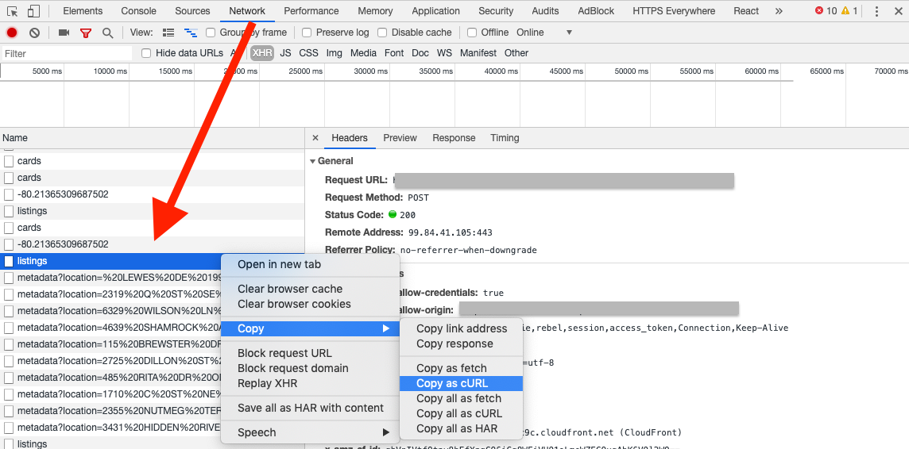
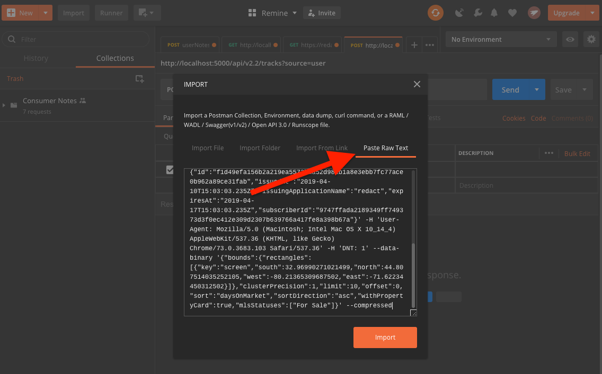
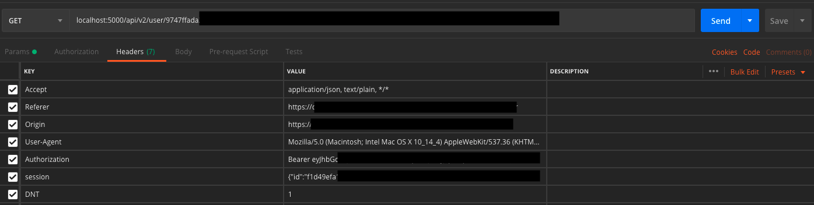

The other day, I found myself making some changes to a network request for our application.

By navigating to a specific page, I knew I’d trigger the call, so that’s what I was doing. At some point, I needed some help and one of the more senior engineers made a comment that I could just copy the `cURL` into Postman.

I didn’t know what that meant, so I did some digging. Here are the why and how to use Postman for your API testing.

# Why Use Postman

Moving the process to Postman, I get several benefits. The two biggest for me are:

1. I speed up my testing cycle - since I don’t have to load the entire page, but can focus on _just_ my one call, each test can be done much more quickly
2. Inspecting the response is easier - I don’t have to navigate through the network tab in Dev Tools each time to find the call I’m interested in, but can use Postman’s UI which is much more suited to the process

# How To Use Postman

1. Navigate to the web page that you know will trigger the network call
2. Open the Dev Tools (The Mac keyboard shortcut for Chrome is `⌘` + `⌥` + `i`)
3. Go to the Network tab
4. Find the request that you’re interested in replicating, and right click on it. The `cURL` can be found in Copy> Copy as cURL
   
5. Open up Postman
6. Use Postman’s Import functionality and paste the copied request into the Raw text section, File > Import > Raw Text. (The keyboard shortcut is `⌘` + `o`)
   
   Note, by copying the `cURL`, you will also bring in all of your headers - including any authorization that may be necessary.
   
