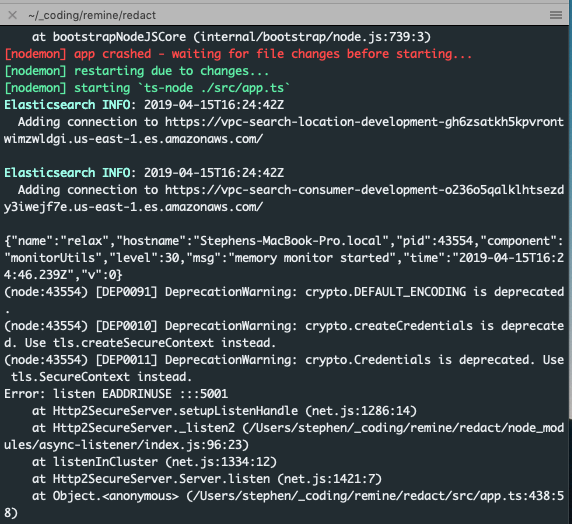

Running my node server, I got an error indicating that my port was already in use (`Error: listen EADDRINUSE :::5001`).

I knew that _shouldn't_ have been the case because I had only one application running on that port.

Still, killing the process multiple times from the console didn't work, so I went in search of the process ID (PID) to kill it specifically.

There are multiple ways to do this, but the one that worked for me out of the box (on Mac) was `lsof` which is the “list open files” program.1

The `-i` flag allows for inclusion of specific ports.

In my case, I was interested in port `5001`, so the command was `lsof -i :5001`.

This returned exactly what I needed:

Apparently the `node` server hadn't terminated and was still using the port, but now I knew the PID. This meant I could hop over to Activity Monitor, look it up and kill it.

Update: It's possible to kill the process directly from the shell using the `kill` command, e.g., `kill 5001`.

Now when I restarted the server it worked like a charm.

## Footnotes

- 1 [3 Ways to Find Out Which Process Listening on a Particular Port | Tecmint](https://www.tecmint.com/find-out-which-process-listening-on-a-particular-port/)
