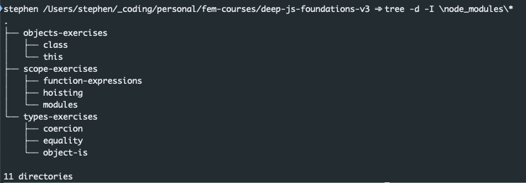
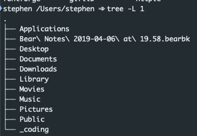

I wanted to be able to print cool trees of my directories to help show my folder structure.
At first, I thought it was simply using standard keys, but it’s more than that.

The good people at Indiana State created a project to help. It’s called Tree.

The home page: [The Tree Command for Linux Homepage](http://mama.indstate.edu/users/ice/tree/)

For Homebrew users, you can install it from your terminal with: `brew install tree`

Once you confirm it’s installed, we can see the options

Once installed, check out the options:

```bash
$ tree --help
  ------- Listing options -------
  -a            All files are listed.
  -d            List directories only.
  -l            Follow symbolic links like directories.
  -f            Print the full path prefix for each file.
  -x            Stay on current filesystem only.
  -L level      Descend only level directories deep.
  -R            Rerun tree when max dir level reached.
  -P pattern    List only those files that match the pattern given.
  -I pattern    Do not list files that match the given pattern.
  --ignore-case Ignore case when pattern matching.
  --matchdirs   Include directory names in -P pattern matching.
  --noreport    Turn off file/directory count at end of tree listing.
  --charset X   Use charset X for terminal/HTML and indentation line output.
  --filelimit # Do not descend dirs with more than # files in them.
  --timefmt <f> Print and format time according to the format <f>.
  -o filename   Output to file instead of stdout.
-------- File options ---------
  -q            Print non-printable characters as '?'.
  -N            Print non-printable characters as is.
  -Q            Quote filenames with double quotes.
  -p            Print the protections for each file.
  -u            Displays file owner or UID number.
  -g            Displays file group owner or GID number.
  -s            Print the size in bytes of each file.
  -h            Print the size in a more human readable way.
  --si          Like -h, but use in SI units (powers of 1000).
  -D            Print the date of last modification or (-c) status change.
  -F            Appends '/', '=', '*', '@', '|' or '>' as per ls -F.
  --inodes      Print inode number of each file.
  --device      Print device ID number to which each file belongs.
  ------- Sorting options -------
  -v            Sort files alphanumerically by version.
  -t            Sort files by last modification time.
  -c            Sort files by last status change time.
  -U            Leave files unsorted.
  -r            Reverse the order of the sort.
  --dirsfirst   List directories before files (-U disables).
  --sort X      Select sort: name,version,size,mtime,ctime.
  ------- Graphics options ------
  -i            Don't print indentation lines.
  -A            Print ANSI lines graphic indentation lines.
  -S            Print with CP437 (console) graphics indentation lines.
  -n            Turn colorization off always (-C overrides).
  -C            Turn colorization on always.
  ------- XML/HTML/JSON options -------
  -X            Prints out an XML representation of the tree.
  -J            Prints out an JSON representation of the tree.
  -H baseHREF   Prints out HTML format with baseHREF as top directory.
  -T string     Replace the default HTML title and H1 header with string.
  --nolinks     Turn off hyperlinks in HTML output.
  ---- Miscellaneous options ----
  --version     Print version and exit.
  --help        Print usage and this help message and exit.
  --            Options processing terminator.
```

Now let’s use it!

Example in a node app:

```bash
$ tree -d -I \node_modules\*
```

This will print only directories that do not match the pattern of node_modules


Example of printing only one level

```bash
$ tree -L 1
```


