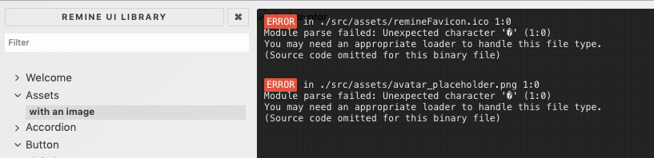

[Storybook supports static files](https://storybook.js.org/docs/configurations/default-config/#image-and-static-file-support), like images. But it wasn’t working for me.

In fact, the way to make a story with a static file is really straightforward. From the docs:

```javascript
import React from 'react'
import { storiesOf } from '@storybook/react'

import imageFile from './static/image.png'

storiesOf('', module).add('with a image', () => (
  
))
```

Unfortunately, when I ran `npm run storybook` I was greeted by several Webpack errors which meant that the whole storybook wouldn’t load.

```
ERROR in ./src/assets/remineFavicon.ico 1:0
Module parse failed: Unexpected character '�' (1:0)
You may need an appropriate loader to handle this file type.
(Source code omitted for this binary file)
 @ ./src/assets/index.js 1:0-63 1:0-63
 @ ./src/assets/Assets.stories.js
 @ ./src sync .stories.(js|jsx|ts|tsx)$
 @ ./.storybook/config.js
 @ multi ./node_modules/@storybook/core/dist/server/common/polyfills.js ./node_modules/@storybook/core/dist/server/preview/globals.js ./.storybook/config.js (webpack)-hot-middleware/client.js?reload=true
```



Just above where the Storybook team talks about the support for static files, they note that they use Webpack to serve and load the JS. They also included the default Webpack config file when you use Storybook with the `create-react-app`.


The critical line for me was about halfway down in the `modules` section:

```javascript
      { test: /\.(svg|ico|jpg|jpeg|png|gif|eot|otf|webp|ttf|woff|woff2|cur|ani)(\?.*)?$/,
        loader: ‘./node_modules/file-loader/dist/cjs.js’,
        query: { name: ‘static/media/[name].[hash:8].[ext]’ },
      },
```

I opened up the `webpack.cofig.js` file for the `storybook` (likely located at `.storybook/webpack.config.js` from the root directory) and used the rule to modify the `baseConfig` file in the following way.

```javascript
const repoConf = require('../webpack.config')
const path = require('path')

module.exports = baseConfig => {
  baseConfig.module.rules.push({
    test: /\.(svg|ico|jpg|jpeg|png|gif|eot|otf|webp|ttf|woff|woff2|cur|ani)(\?.*)?$/,
    loader: './node_modules/file-loader/dist/cjs.js',
    query: { name: 'static/media/[name].[hash:8].[ext]' },
  })

  baseConfig.resolve.extensions = repoConf.resolve.extensions
  baseConfig.resolve.alias = {
    ...baseConfig.resolve.alias,
    ...repoConf.resolve.alias,
  }

  return baseConfig
}
```

That did the trick! Once those changes were made, my storybook loaded and my images came through.

(Full disclosure, we had _other_ rules that modified the `baseConfig` in a similar fashion, so I had a model to build on.)
