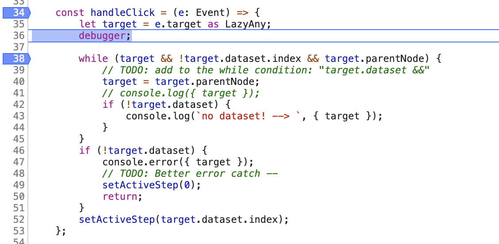

I was investigating a situation _where_ my application was deviating from my expectations during runtime — aka bug fixing.

Opening up my Chrome Dev Tools, I started by looking at the page's source code there and setting breakpoints.

The problem? The breakpoints never tripped and the code was able to continue along as if nothing happened.

In investigating, it appears that the reason this happened is that the code was transpiled.

The solution was simply adding in a `debugger` statement into the function.

My first thought at this discovery was frustration (I had spent quite a bit of time trying to get the break to trigger). My second thought was, “Sometimes it's the simplest answer that's the solution” followed quickly by “Now I know one more thing, how glorious!”

