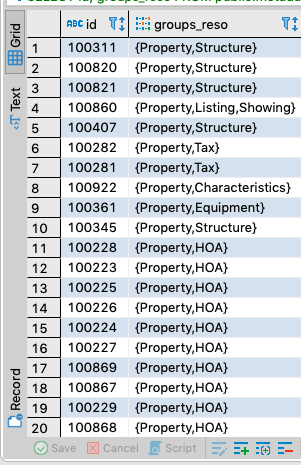
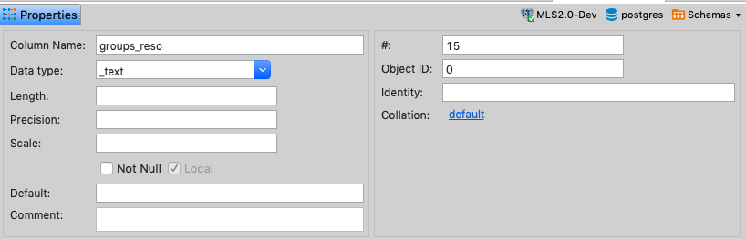

When looking around a table in Postgres today, I noticed a curious looking field. `groups_reso` _looked_ like a collection, but when I looked at the Data Type, it was listed as `_text`.


I didn’t know what the underscore meant, and looking into the data types didn’t immediately yield the confirmation I sought, so while I felt like it was an Array, I couldn’t be sure.



Fortunately, I had access to the `create table` script and could eventually confirm my suspicion that it was in fact an Array.

```psql
create table if not exists metadata_fields (
    id text
    ...
    , groups_reso text[]
    ...
);
```

# Accessing Array Properties

Now, that I had that information, I could think about how to access specific properties.

For example, `Property` is always in the first position of a collection if it’s present, so, let’s say I wanted to only select rows which included that property, I would do:

```psql
SELECT id, groups_reso
FROM public.metadata_fields
where groups_reso[1] = 'Property';
```

Or, the inverse - all records where the first property is _not_ equal to `Property`:

```psql
SELECT id, groups_reso
FROM public.metadata_fields
where groups_reso[1] <> 'Property';
```

Attentive readers may notice that the index used here is `[1]` to refer to the _first_ property. That’s because “[b]y default, PostgreSQL uses one-based numbering for array elements.” ¹

Lots more to learn, but at least I can now move forward.

# Resources

- ¹ [PostgreSQL Array](http://www.postgresqltutorial.com/postgresql-array/)
- [PostgreSQL Data Types](http://www.postgresqltutorial.com/postgresql-data-types/)
