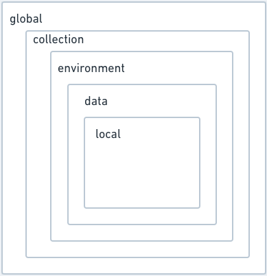
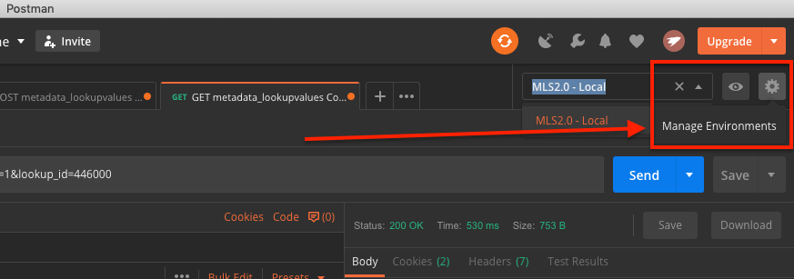
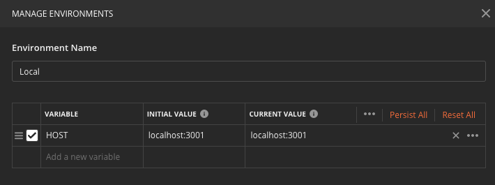
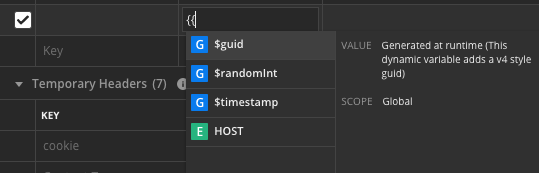

# Variables in Postman

I’ve written in the past about why I like testing my [APIs with Postman](../../2019-04-13/testing-api-with-curl-and-postman). Today, I learned that they have yet another feature that makes my life easier — Environment Variables.¹

Just like using a variable in a codebase to point to a piece of information that you want to reuse multiple places, Postman variables enable reuse without duplication. They create a single point of entry and management (which [I’ve written about as a feature in the past](../../2019-07-01/array-intersection-in-psql/)).

# Managing Scope

Postman offers five different levels of scope¹ - which I’m sure will be useful for more power users. For me - the Environment Scope is where I care most — though I can see myself also benefiting from Collections in the future as I work on more and more projects.

With environments being the most useful at this time for me, that’s where I’m focusing.

# Managing Environments

To create an Environment, select the Gear icon in the top right of your Postman window and click on “Manage Environments”

From here, you can manage a single environment (or multiple).

In this case, I’ve created a `HOST` variable so that I can easily switch between my local environment and hitting the endpoints in staging or production.

# Using Variables

Once a variable’s been saved, it can be included in the path bar - I did below for the `HOST`.

It can also be used in a Param or Header section.

# Conclusion

Using variables is easy and makes managing different environments so much easier than what I was doing before - which included a mix of manual management and maintaining multiple APIs with the environment in the label.

# Resources

- ¹ [Variables | Postman](https://learning.getpostman.com/docs/postman/environments_and_globals/variables/)
