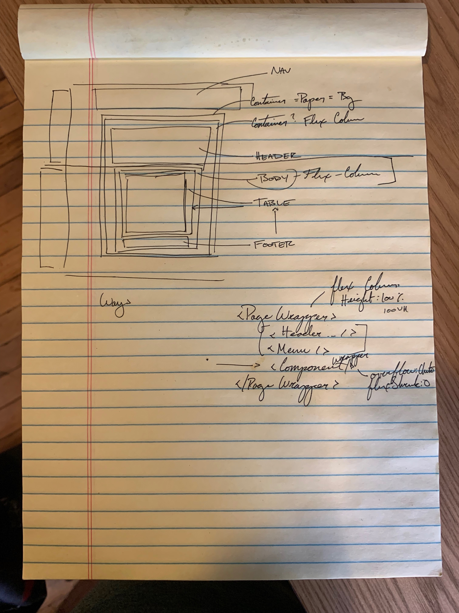

One of my ongoing challenges with layouts on the web is the fact that a website does not naturally have an end. Unlike an 8.5”x11” sheet of paper, a website can go on forever.

That was the crux I faced when trying to get a layout to respond to the size of the window _without_ referencing the window or viewport. Basically, I wanted to know if there was a way to style my components in a way that it would appropriately constrain its contents which _wanted_ to grow.

What do I mean? This video shows how the table _wants_ to grow, but if `internalScroll` is `true` it will collapse to only fill what’s available.


That’s a good start - but did you notice the `containerSize` prop that’s acting as the constraint? Since the screen size and resolution a user could be using can vary dramatically, I wanted a dynamic solution. That meant that while the `internalScroll` would be useful, it was only half of the equation. I also needed the container size.

To add to the fun, the page I was working on looked a little like this:


There was a lot more than just a container and a table. So, any solution I came up with had to take all of those pieces into account.

Flex to rescue. To make sure I understood how, I put together a mockup with JSFiddle.¹

I pulled together a rough approximation of the layout of my app using basic HTML.
```html
<div class="wrapper">
  <div class="flexbox-item header"> Nav </div>
  <div class="wrapper">
    <div class="page-header flexbox-item">Page Header</div>
    <div class='table-container fill-area content flexbox-item-grow'>
      <div class='table-body flexbox-item fill-area content'>
        Content
        <br /> <br />
        "Lorem ipsum …” // Put enough in here to make sure that it will exceed the height of the page.
      </div>
      <div class='table-footer flexbox-item'>footer</div>
    </div>
  </div>
</div>
```

With that in place, it was time to work through the CSS. Fortunately, enough google searches got me a good starting point.²

In the end, my solution was quite simple:
``` css
/* Every wrapping container is 100% height */
.wrapper {
  height: 100%;
  display: flex;
  flex-direction: column;
}

/* This is the key to the whole thing */
.fill-area {
  overflow: auto;
  flex: 1;
}
```

When I see it written out like that, it feels like I should have been able to get to a solution much faster!

Regardless, I did get to a working solution and I’m pleased with how it turned out!

My thanks to Eric @ Visual Pulse³ whose JSFiddle was the inspiration I needed to get to my own solution and Sung Kim for his eyes and help in refining my early solutions.⁴

Footnotes:
* ¹ [Scrollable Internal Content - JSFiddle](https://jsfiddle.net/stephencweiss/zyjwgptr/)
* ² [Height 100% in Flexbox Item | JSFiddle](https://jsfiddle.net/MadLittleMods/LmYay/)
* ³ [Eric’s Fiddles | JSFiddle](https://jsfiddle.net/user/MadLittleMods/fiddles/)
* ⁴ [Sung M. Kim | DEV.to](https://dev.to/dance2die)
