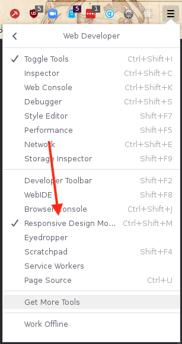
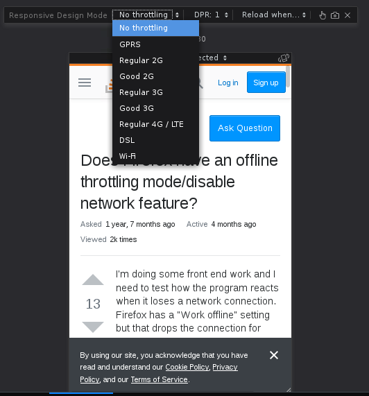

Testing my app on a slower connection is a key part of my development cycle. That's why when I recently found myself developing within Firefox, I was thrown off because the way to simulate a slow connection is not where I'd grown accustomed to it.

In Chromium flavored browsers, it's a pick list within the Network tab of the Developer tools.

In Firefox? You have to go into the Responsive Mobile Design (`Ctrl + ⇧ + M`). According to Firefox, the only reason you'd care about network speeds is on mobile.

Step-by-step in Firefox:

