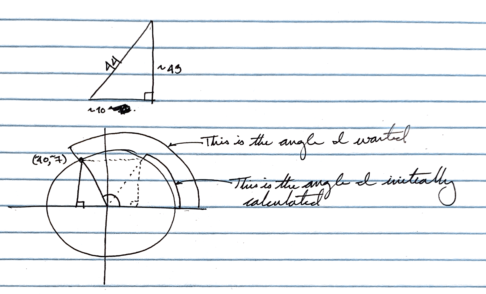

Given a score within a range, how could we visualize that on a dial? That was what I got to work on recently and it turned out to be a ton of fun!


(The animation was a late addition and it’s implementation was inspired by my friend Justin who had the insight that to use score to re-render as it increased.)

## Observations And Lessons

A few observations from the experience:

First and foremost: to all those folks who asked when we’d use trigonometry in the real world… I found the answer

Secondly, brushing off those trigonometry and geometry lessons from middle school turned out to be surprisingly fun.

Two resources in particular I used heavily:

- Triangle Calculator: [Triangle Calculator](https://www.calculator.net/triangle-calculator.html)
- Degrees to Radians Calculator: [Degrees to Radians conversion](https://www.rapidtables.com/convert/number/degrees-to-radians.html)

Third, a lot of the implementation required understanding _where_ on the edge of the circle I was given the score. I ended up calculating that thanks to the “parametric equation” for a circle which I found, as usual via StackOverflow<sup>1</sup>

The one part of magic that I never quite understood was _why_ I reversed the sign on the Y coordinate. I’m sure it has something to do with the direction of rotation and where I’m starting from, but still, I couldn’t quite work through it.

```javascript
const calculateEdgeCoordinates = internalAngle => {
  // Uses the Parametric Equation for a circle: https://stackoverflow.com/a/839931/9888057
  const xCoord = ORIGIN.X + RADIUS * Math.cos(internalAngle)
  const yCoord = ORIGIN.Y - RADIUS * Math.sin(internalAngle)
  return { xCoord, yCoord }
}
```

Fourth, context matters. A triangle is not a triangle if it’s in a different quadrant. Wait, what?

Just kidding. It’s still a triangle. It’s just more than that, because _where_ it is matters. For example, the ending point for the Very Low score (~40, ~7) initially tripped me up.

Initially, when I calculated the triangle created by the hypotenuse between the origin and the point (~40, ~7), I only looked at the lengths of the sides to calculate the angles.

This was the right triangle, but in my quadrant, it put the edge at (~60, ~7).

That’s clearly not right and once I put it on paper, I could see that clearly. Mirroring the triangle over the Y-axis and using my angle identities I was able to arrive at the correct distance.

## Conclusion

Overall, I’m very pleased with how this turned out and had a ton of fun along the way — even if I am sure I exhausted my wife and friends with all of my questions. With that in mind, I’ll likely be taking a bit of a break from the trig and SVGs.

Here’s the full code:

```javascript
import React, { useState } from ‘react’;

const defaultSize = {
    width: ‘100%’,
    height: ‘100%’,
};
const RADIUS = 44; // !Attention! Changing radius _will_ break this SVG unless the points along the circumference (i.e. Origin, etc) are adjusted accordingly
const ORIGIN = {
    X: 50,
    Y: 50,
};
const MIN_SCORE = 0;
const MAX_SCORE = 1000;
const UNKNOWN_SCORE = new Error(`Score is outside of accepted range`);

export enum Rating {
    VERYHIGH = 'Very High',
    HIGH = 'High',
    MEDIUM = 'Medium',
    LOW = 'Low',
    VERYLOW = 'Very LOW',
}

export enum RatingThreshold {
    VERYHIGH = 850,
    HIGH = 750,
    MEDIUM = 650,
    LOW = 450,
    VERYLOW = MIN_SCORE,
}

const getThreshold = score => {
    if (score >= RatingThreshold.VERYLOW && score < RatingThreshold.LOW) return RatingThreshold.VERYLOW;
    else if (score >= RatingThreshold.LOW && score < RatingThreshold.MEDIUM) return RatingThreshold.LOW;
    else if (score >= RatingThreshold.MEDIUM && score < RatingThreshold.HIGH) return RatingThreshold.MEDIUM;
    else if (score >= RatingThreshold.HIGH && score < RatingThreshold.VERYHIGH) return RatingThreshold.HIGH;
    else if (score >= RatingThreshold.VERYHIGH && score <= MAX_SCORE) return RatingThreshold.VERYHIGH;
    else throw UNKNOWN_SCORE;
};

const interpretScore = (score: number) => {
    if (score >= RatingThreshold.VERYHIGH)
        return {
            rating: Rating.VERYHIGH,
            highlight: ‘aqua’,
            startingInternalAngle: 0.199927, // (11.455 / 180) * Math.PI,
            endingInternalAngle: -0.4398229715, // (-25.2) / 180 * Math.PI
            rangeStart: RatingThreshold.VERYHIGH,
            rangeEnd: MAX_SCORE,
        };
    else if (score >= RatingThreshold.HIGH)
        return {
            rating: Rating.HIGH,
            highlight: ‘green’,
            startingInternalAngle: 0.645458, // ((205.2 - 168.218) / 180) * Math.PI,
            endingInternalAngle: 0.33197907702, // (19.021 / 180) * Math.PI
            rangeStart: RatingThreshold.HIGH,
            rangeEnd: RatingThreshold.VERYHIGH - 1,
        };
    else if (score >= RatingThreshold.MEDIUM)
        return {
            rating: Rating.MEDIUM,
            highlight: ‘yellow’,
            startingInternalAngle: 1.154972, // ((205.2 - 139.025) / 180) * Math.PI,
            endingInternalAngle: 0.77750927518, // (44.548 / 180) * Math.PI
            rangeStart: RatingThreshold.MEDIUM,
            rangeEnd: RatingThreshold.HIGH,
        };
    else if (score >= RatingThreshold.LOW)
        return {
            rating: Rating.LOW,
            highlight: ‘pink’,
            startingInternalAngle: 1.664468, // ((205.2 - 109.833) / 180) * Math.PI,
            endingInternalAngle: 1.2870232437, // (73.741 / 180) * Math.PI
            rangeStart: RatingThreshold.LOW,
            rangeEnd: RatingThreshold.MEDIUM,
        };
    else if (score >= RatingThreshold.VERYLOW)
        return {
            rating: Rating.VERYLOW,
            highlight: ‘red’,
            startingInternalAngle: 3.5814156251, // (205.2 / 180) * Math.PI,
            endingInternalAngle: 1.7965372122, // (102.934 / 180) * Math.PI
            rangeStart: RatingThreshold.VERYLOW,
            rangeEnd: RatingThreshold.LOW,
        };
    else throw UNKNOWN_SCORE;
};

const calculateDistancePerIncrementalPoint = score => {
    // Note: This is included because of the weirdness that the gaps introduce
    // This calculation enforces a consistency of travel within each section for an incremental point in score
    const { startingInternalAngle, endingInternalAngle, rangeStart, rangeEnd } = interpretScore(score);
    const range = rangeEnd - rangeStart;
    const distanceTraveled = Math.abs(endingInternalAngle - startingInternalAngle);
    const distancePerPoint = distanceTraveled / range;
    return distancePerPoint;
};

const calculateInternalAngle = score => {
    // The internal angle is the angle from 0° in radians
    const distancePerIncrementalPoint = calculateDistancePerIncrementalPoint(score);
    const { startingInternalAngle } = interpretScore(score);
    const distanceToTravel = (score - getThreshold(score)) * distancePerIncrementalPoint;
    const internalAngle = startingInternalAngle - distanceToTravel;
    return internalAngle;
};

const calculateEdgeCoordinates = internalAngle => {
    // Uses the Parametric Equation for a circle: https://stackoverflow.com/a/839931/9888057
    const xCoord = ORIGIN.X + RADIUS * Math.cos(internalAngle);
    const yCoord = ORIGIN.Y - RADIUS * Math.sin(internalAngle);
    return { xCoord, yCoord };
};

const partialStroke = (score, highlight) => {
    const { xCoord: startX, yCoord: startY } = calculateEdgeCoordinates(calculateInternalAngle(getThreshold(score)));
    const { xCoord: finalX, yCoord: finalY } = calculateEdgeCoordinates(calculateInternalAngle(score));

    return (
        <path
            d={`M ${startX} ${startY} A ${RADIUS} ${RADIUS} 0 0 1 ${finalX} ${finalY}`}
            stroke={highlight}
            fill="none"
            stroke-width="4"
            stroke-linecap="round"
        />
    );
};

const ScoreDial = (props: { score: number }) => {
    const [score, setScore] = useState(MIN_SCORE);
    if (Math.ceil(score) < props.score) {
        setTimeout(() => setScore(Math.ceil((props.score - score) / 50 + score)), 10);
    }

    const { rating, highlight } = interpretScore(score);
    const { xCoord: circleX, yCoord: circleY } = calculateEdgeCoordinates(calculateInternalAngle(score));

    return (
        <svg style={defaultSize} viewBox="0 0 100 80" className="score-dial" aria-labelledby="title">
            <title>Score Dial</title>

            {/* This is the grey, unfilled portion of the dial, i.e. the background */}
            <g>
                <g>
                    {/* VERYLOW */}
                    <path
                        d={`M 10.187609691495148 68.73428882886321 A ${RADIUS} ${RADIUS} 0 0 1 40.15168157318339 7.116312843179813`}
                        stroke="#E1E7EB"
                        fill="none"
                        stroke-width="4"
                        stroke-linecap="round"></path>
                    {/* LOW */}
                    <path
                        d={`M 45.88425608935777 6.192915503745162 A ${RADIUS} ${RADIUS} 0 0 1 62.31904483262065 7.759721421232527`}
                        stroke="#E1E7EB"
                        fill="none"
                        stroke-width="4"
                        stroke-linecap="round"></path>
                    {/* MEDIUM */}
                    <path
                        d={`M 67.77387663242357 9.749666964664904 A ${RADIUS} ${RADIUS} 0 0 1 81.35697639031021 19.133512806645328`}
                        stroke="#E1E7EB"
                        fill="none"
                        stroke-width="4"
                        stroke-linecap="round"></path>
                    {/* HIGH */}
                    <path
                        d={`M 85.1483635955568 23.531291369722304 A ${RADIUS} ${RADIUS} 0 0 1 91.59754139263299 35.65968793616452`}
                        stroke="#E1E7EB"
                        fill="none"
                        stroke-width="4"
                        stroke-linecap="round"></path>
                    {/* VERYHIGH */}
                    <path
                        d={`M 93.1236326880653 41.26201946758718 A ${RADIUS} ${RADIUS} 0 0 1 89.81239030850486 68.73428882886319`}
                        stroke="#E1E7EB"
                        fill="none"
                        stroke-width="4"
                        stroke-linecap="round"></path>
                </g>
            </g>

{/* This is the filled in portion of the dial, i.e. the foreground */}
            <g>
                <g>
                    {/* If better than LOW, fill VERYLOW */}
                    {score >= RatingThreshold.LOW && (
                        <path
                            d={`M 10.187609691495148 68.73428882886321 A ${RADIUS} ${RADIUS} 0 0 1 40.15168157318339 7.116312843179813`}
                            stroke={highlight}
                            fill="none"
                            stroke-width="4"
                            stroke-linecap="round"
                        />
                    )}
                    {/* If better than MEDIUM, fill LOW*/}
                    {score >= RatingThreshold.MEDIUM && (
                        <path
                            d={`M 45.88425608935777 6.192915503745162 A ${RADIUS} ${RADIUS} 0 0 1 62.31904483262065 7.759721421232527`}
                            stroke={highlight}
                            fill="none"
                            stroke-width="4"
                            stroke-linecap="round"></path>
                    )}
                    {/* If better than HIGH, fill MEDIUM */}
                    {score >= RatingThreshold.HIGH && (
                        <path
                            d={`M 67.77387663242357 9.749666964664904 A ${RADIUS} ${RADIUS} 0 0 1 81.35697639031021 19.133512806645328`}
                            stroke={highlight}
                            fill="none"
                            stroke-width="4"
                            stroke-linecap="round"></path>
                    )}
                    {/* If better than VERYHIGH, fill HIGH */}
                    {score >= RatingThreshold.VERYHIGH && (
                        <path
                            d={`M 85.1483635955568 23.531291369722304 A ${RADIUS} ${RADIUS} 0 0 1 91.59754139263299 35.65968793616452`}
                            stroke={highlight}
                            fill="none"
                            stroke-width="4"
                            stroke-linecap="round"></path>
                    )}
                    {partialStroke(score, highlight)}
                </g>

                {/* This is the circle marker indicating the actual score */}
                <g>
                    <circle r="6" fill={highlight} cx={circleX} cy={circleY}></circle>
                    <circle r="2.5" fill="#fff" cx={circleX} cy={circleY}></circle>
                </g>
            </g>
            {/* This is the central text */}
            <g>
                <text x={ORIGIN.X} text-anchor="middle" y={ORIGIN.Y + 4} font-size="28">
                    {String(score)}
                </text>
                <text x={ORIGIN.X} text-anchor="middle" y={ORIGIN.Y + 20} font-size="8">
                    {rating}
                </text>
            </g>
        </svg>
    );
};

export default ScoreDial;
```

## Resources

- <sup>1</sup> [How do I calculate a point on a circle’s circumference? | StackOverflow](https://stackoverflow.com/a/839931/9888057)
