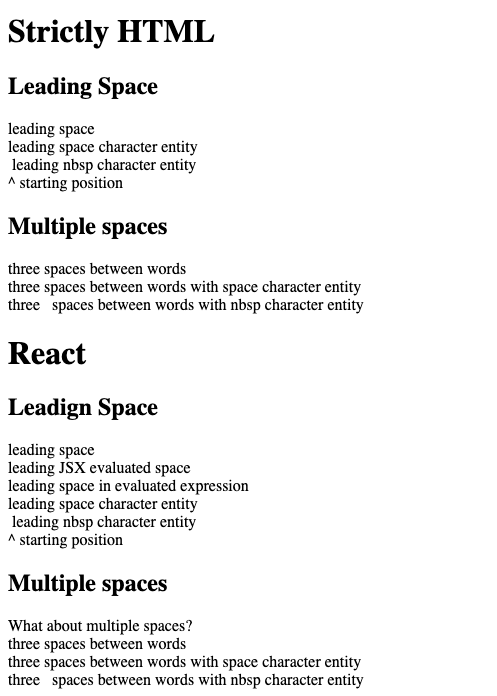

One of the more frustrating little quirks about HTML is its insistence on collapsing white space.

This is actually often more useful than it’s annoying, but still - when you _want_ a space, how do you do it?

Turns out, one way is with HTML Character Entities.<sup>1</sup> If you’ve ever seen someone type `&rarr;` to create a &rarr;, then you’ve seen a character entity. (Freeformatter.com has a full list of characters with their entity number<sup>2</sup>)

For my purposes, I was working in React and I wanted two components to be separated by a space. That meant I couldn’t allow the compilation process down to HTML to collapse my spaces.

It turns out that is _exactly_ the difference between a normal space and a “non-breaking space”.

Looking at HTML specifically, I wanted to see how these would work.
``` html
<h1>Strictly HTML</h1>
<div>
  <h2>
  Leading Space
  </h2>
  <div> leading space</div>
  <div>&#32;leading space character entity</div>
  <div>&nbsp;leading nbsp character entity</div>
  <div>^ starting position</div>
</div>
<div>
  <h2>Multiple spaces</h2>
  <div>three spaces between words</div>
  <div>three&#32;&#32;&#32;spaces between words with space character entity</div>
  <div>three&nbsp;&nbsp;&nbsp;spaces between words with nbsp character entity</div>
</div>
```

I also mounted React to the DOM and tested it with JSX to get equivalent results (with a few extra tests to see how JSX evaluation would work):
```javascript
const App = () => (
  <div>
    <h1>React</h1>
    <div>
      <h2>Leading Space</h2>
      <div> leading space</div>
      <div>{' '}leading JSX evaluated space</div>
      <div>{`${' '}${'leading space in evaluated expression'}`}</div>
      <div>&#32;leading space character entity</div>
      <div>&nbsp;leading nbsp character entity</div>
      <div>^ starting position</div>
    </div>
    <div>
      <h2>Multiple spaces</h2>
      <div>What about multiple spaces?</div>
      <div>three   spaces between words</div>
      <div>three&#32;&#32;&#32;spaces between words with space character entity</div>
      <div>three&nbsp;&nbsp;&nbsp;spaces between words with nbsp character entity</div>
    </div>
  </div>
);
```

The results proved out the point — leading spaces are collapsed (as, by the way, are trailing spaces) unless we use the non-breaking space character.


If you’re interested in playing around yourself, I used JSFiddle to help me visualize the differences<sup>1</sup>.

By the way, you may also see `\U00A0`. This is the unicode character for the “no-break space”.<sup>4</sup> There appear to be several other ways to identify the character depending on the encoding used (UTF-8, UTF-16, python, etc.)

## Conclusion
To get the spaces you want to show up in HTML that you expect, use the HTML character entity - specifically `&nbsp;` for the non-breaking space character.

These entities are also a great way to introduce other visually appealing characters, like a right arrow (though Unicode is another good option).

* <sup>1</sup> [HTML Entities | W3Schools](https://www.w3schools.com/html/html_entities.asp)
* <sup>2</sup> [Complete list of HTML entities | FreeFormatter](https://www.freeformatter.com/html-entities.html)
* <sup>3</sup>[HTML Spaces | JSFiddle](https://jsfiddle.net/stephencweiss/37s9vpd0/10/)
* <sup>4</sup>[Unicode Character ‘NO-BREAK SPACE’ (U+00A0)](https://www.fileformat.info/info/unicode/char/00a0/index.htm)
