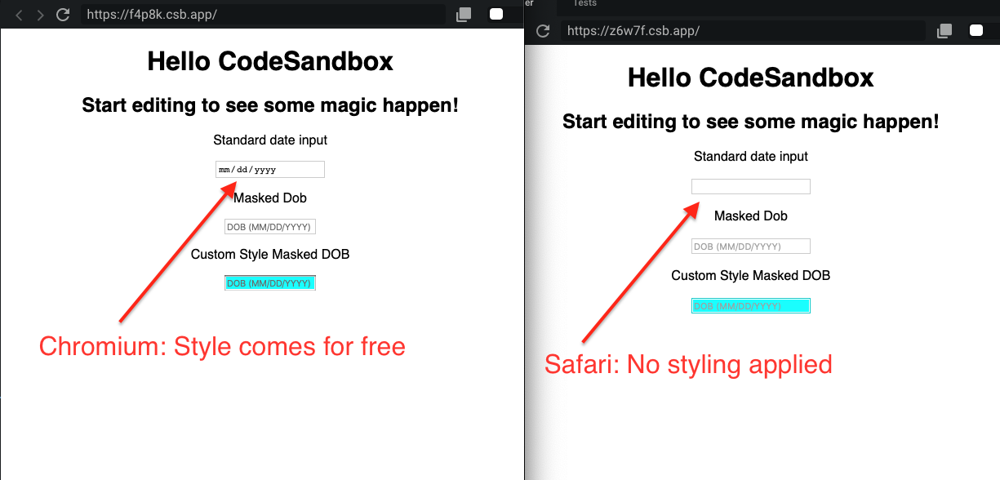

In learning about [Auto-Complete In HTML Forms](../../2019-10-07/auto-complete-forms), I discovered that the `type` of an `<input>` makes can make a significant difference in how they are presented to users. The differences, however, are browser specific.

Take `type="date"` for example. Chromium browsers supply quite a bit of styling for free. Safari adds nothing.

The standard inputs in the screenshots below are simply:

```javascript
const app = () => {
  return (
    {/* … */}
    <p>Standard date input</p>
    <input type="date" placeholder={"dob mm/dd/yyyy"} />
    {/* … */}
  )
}
```



To not be at the whim of a browser, I reverted back to a standard input and sought other approaches.

In this particular case, I really wanted to provide guidance to users on how to put the information in since formatting is important for the application to work properly.

To think about how this would work, I thought about passwords, but in reverse. Instead of taking a password and turning it into a string of ● (e.g., `pa$$w0rd` becomes `●●●●●●●●`), I wanted a string that could be overwritten. In this case `__/__/____`.

CSS Tricks outlined several approaches depending on the stack - vanilla JS, jQuery, etc. and also noted some accessibility considerations to bear in mind (like that certain approaches will use the `value` of the input, not the `placeholder` to display the mask). <sup>1</sup>

I ended up selecting the library `react-text-mask` because of it’s support for React and `styled-components`. The latter, however, turned out to be more fun than I was expecting when I started, largely thanks to `refs`.

The library provides a `render` method for custom `<input>` components which is noted helpfully [in the docs](https://www.npmjs.com/package/react-text-mask#customize-rendered-input-component). Interestingly for me, the way this method works is by providing its own ref which can be passed along to the styled component.

From the docs:

> For example, to use with styled-components, [which requires an innerRef](https://www.styled-components.com/docs/advanced#refs):
>
> ```javscript
> <MaskedInput
>   mask={[‘(‘, /[1-9]/, /\d/, /\d/, ‘)’, ‘ ‘, /\d/, /\d/, /\d/, ‘-‘, /\d/, /\d/, /\d/, /\d/]}
>   placeholder="Enter a phone number"
>   id="my-input-id"
>   render={(ref, props) => (
>     <MyStyledInput innerRef={ref} {…props} />
>   )}
> />
>
> const MyStyledInput = styled.input`
>   background: papayawhip;
> `;
> ```

Notice that the render method has an argument `ref` that’s passed along to the `<MyStyledInput>`? That’s provided by the component! There's no need to create a ref in a containing component, no need for `useRef` or `forwardRef`! It's actually quite simple.

Part of my confusion lay in the demonstration of using `innerRef`. As of v4, [`styled-components` do not require an `innerRef`](https://www.styled-components.com/docs/api#deprecated-innerref-prop), however, despite having _read_ the `styled-component` documentation, it still took a conversation with several others to understand that the `innerRef` was part of the `styled-component` api and not the `react-text-mask`. In retrospect should have been more obvious.

After all of that, I arrived at a working solution: Masking the input, guiding my users, and providing a consistent user experience across browsers and devices.

If you’re interested, you can see my prototype in a [Code Sandbox](https://codesandbox.io/s/masked-inputs-z6w7f).

## Footnotes

- <sup>1</sup> [Input Masking | CSS-Tricks](https://css-tricks.com/input-masking/) is a great start, and as noted, Estelle Wyel has a React compatible approach, though I ended up using a different library.
- <sup>2</sup> [react-text-mask | npm](https://www.npmjs.com/package/react-text-mask)
