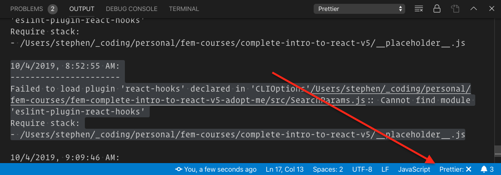

A while ago I installed the Prettier extension in VSCode and configured a few defaults in my global settings. I like having a global configuration so that I don’t have to go through the steps of setting up each project. Sometimes, however, that can create problems. For example, when ESLint and Prettier stop cooperating.

When that happens, Prettier just stops working. Kindly, VSCode alerts me, with a little `x` in the bottom bar, but the error messages have always been a bit cryptic.


Here’s a recent example:

```shell
10/4/2019, 8:52:55 AM:
----------------------
Failed to load plugin 'react-hooks' declared in 'CLIOptions'/Users/stephen/_coding/personal/fem-courses/fem-complete-intro-to-react-v5-adopt-me/src/SearchParams.js:: Cannot find module 'eslint-plugin-react-hooks'
Require stack:
- /Users/stephen/_coding/personal/fem-courses/complete-intro-to-react-v5/__placeholder__.js
```

Since I could still get formatting to work by running prettier in the command line, it’s never felt urgent. Still, today, I decided to dig into it to see if there was an answer.

Apparently, this is a known issue and has to do with how ESLint and Prettier interact.

There are threads for similar issues for Atom<sup>1</sup>, VSCode<sup>2</sup>, and Prettier<sup>3</sup>. I’m sure there are others.

Reading through the threads, I found a solution that works at least for VSCode, per [@2Color](https://github.com/2color):<sup>4</sup>

> Try changing
> `"prettier.eslintIntegration": true`
> to
> `"prettier-eslint.eslintIntegration”: true`
> in Settings (JSON) for VS Code.
> Fixed the problems that I was having after upgrading to ESLint 6.x.

I made the change and suddenly everything was back to normal!

Actually - that’s not totally true. Hovering over the new line, VSCode was telling me that it was an “Unknown Configuration Setting”. So, I deleted it all together. It still works! At least in this project, which _does_ have a `.prettierrc`, even if it’s just an empty set of `{}`.

I’ll be keeping an eye on this, but if nothing else, at least I have a working solution for the future.

## Footnotes

- <sup>1</sup> [Failed to load plugin ‘prettier’ declared in ‘CLIOptions’: Cannot find module ‘eslint-plugin-prettier’ · Issue #505 · prettier/prettier-atom | GitHub](https://github.com/prettier/prettier-atom/issues/505)
- <sup>2</sup> [ESLint fails to load plugins when using ESLint 6.x · Issue #696 · microsoft/vscode-eslint | GitHub](https://github.com/microsoft/vscode-eslint/issues/696)
- <sup>3</sup> [Cannot find module ‘../ast-utils’ when formating · Issue #672 · prettier/prettier-vscode · GitHub](https://github.com/prettier/prettier-vscode/issues/672)
- <sup>4</sup> [@2Color’s solution](https://github.com/microsoft/vscode-eslint/issues/696#issuecomment-528305585) was the first that worked for me.
