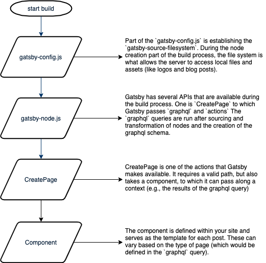

Imagine you have a website, like this one, that aims to publish regularly. You’re not a big publication. You don’t have a full-time staff dedicated to making sure the presses run every night. At the same time, your schedule is inconsistent at best and your ability to write a new article daily is not guaranteed.

What can you do?

Finding myself in that situation, I settled on creating a very simple (and, as we’ll see, imperfect) publishing embargo.

Before we get into _how_ I embargo content on my website, let’s get establish some baselines around the problem in the context of a static site.

## Client-Server & HTTP

A quick review: when you type in the domain to go to this website (www.stephencharlesweiss.com) into your browser, the first thing that happens is to resolve the location via the domain name servers (assuming your browser doesn’t have it in cache).[1](#fn1)

Once you have the location for the servers for this site, your computer (the client) will communicate directly with the server that hosts the information for this site to retrieve the contents (HTML, CSS, and JS):

|  |
| :-------------------------------------------------------------------------------: |

| A diagram of the classic web application communication model[2](#fn2)

## Static Sites

Static sites are what they sound like. They’re built and then the data doesn’t change. In the case of my site, I don’t even have additional AJAX requests. When you visit my site, you get the entire thing (more or less — Gatsby does a lot in terms of lazy loading to make the experience feel snappy) up front.

What this _really_ means though is that the data you receive won’t change unless there’s a build event on the server. That is, unless I change the content of the site.

What happens then if I want to create a publishing schedule that smooths out my inconsistency? Where posts only become available _after_ their "publication" date (not necessarily the same as the date they’re written)?

For several months, I managed this by merging in the posts into the master build on the day I wanted them to be available and rebuilding the site. This was getting tiresome and I figured there had to be a better way.

## Strategies For Addressing Manual Work

A few recent experiences coalesced to inspire me to fix the fact that I was spending time every day doing rote work that wasn’t actually adding value:

1. I spoke with a friend who used to work at a newspaper who was describing how often times they’d have big features that would be embargoed for the website until they were published in print.
2. I read an article, "[Manual Work is a Bug](https://queue.acm.org/detail.cfm?id=3197520)" which made a compelling argument that the people who figure out how to automate the rote work are those who keep advancing to solve more interesting problems.

With this backdrop, I started investigating if there was a way to embargo my content and lighten my load.

I came up with a few different approaches:

1. Separate my database from my build process. This would mean that when the page is loading, it would hit a separate server to get the content.
2. Schedule a daily build using a "cron" job.[3](#fn3)
3. Filter the data on the client side.

The third route was by far the simplest way I could come up with that would achieve my desired affect — if you visited my site, you would only _see_ the published articles.[4](#fn4)

## Gatsby’s Build Process

NB: The following section will discuss some of the details around the implementation. If you’d prefer to see code, check out the [merge request that added the embargo on Github](https://github.com/stephencweiss/personal-blog/pull/136/files?file-filters%5B%5D=.js&file-filters%5B%5D=.json&file-filters%5B%5D=.jsx).

My [initial approach](https://github.com/stephencweiss/personal-blog/pull/136/commits/7a5f8a0ebd186d37c6b96cd197470f35afb62dbe) for filtering out unpublished content focused on the `gatsby-node.js` file where the pages for the site are actually built during the build process.

I spent longer than I care to admit trying to get this to work before putting two and two together: Gatsby is a _static_ site generator. The server code is run _once_, at build time, and then never again.

That means, even if I passed in a variable for the current date and time, the result would be that I would filter out all posts that weren’t published at the time of build… and then they would _stay_ excluded until the next build.

The whole point of this exercise, however, was that I didn’t want to have to press a button to rebuild my site every day.

## Client-Side Javascript - Simple, But Has Drawbacks

When a website loads, there are typically three files that are loaded: HTML, CSS, and, in most modern sites, Javascript. The latter is what makes sites interactive.

It’s also how I created a filter.

Simply put, I sent the _entire_ site to the client, and then when painting the DOM with Javascript, I would ask: Is this post supposed to be visible? Yes? Great, create an index entry. No? Skip! Onto the next one.

This approach has two very real drawbacks:

1. If you subscribe to the RSS feed for my site, you get posts when the site is built, _even if you don’t see them on the main page_.
   
2. If you were to look in the data you received during the initial load of the site, you’d see _extra_ pages that weren’t rendered.
   

## Conclusion 

My "embargo" is wholly unsuited for any site that actually cares about keeping content under wraps until a true publish date.

I don’t suffer from that constraint. My entire goal was to make control over what was visible on my site a little easier and eliminate the need to build my site daily.

I may revisit this problem in the future and investigate scheduling a cron job to build daily (allowing my to filter out the content client side) or to separate out my database from the site and add an extra network call.

Until then, if you’re so inclined and you’d like to see into the future - subscribe to my RSS. I won’t mind.

## Footnotes

- [1](#sup1) I found this [introduction to HTTP and Domain Name System servers](https://www.freecodecamp.org/news/an-introduction-to-http-domain-name-system-servers-b3e7060eca98/) video on the basics of the DNS server a useful refresher.
- [2](#sup2) [How does AJAX work? | Stack Overflow](https://stackoverflow.com/questions/1510011/how-does-ajax-work)
- [3](#sup3) A cron job is simply a job that runs on a schedule. A common approach for Gatsby sites is to use a web hook service like Zapier to manage this. [cron - Wikipedia](https://en.wikipedia.org/wiki/Cron)
- [4](#sup4) As I’ll describe a little later - this is a visual trick and the data for the unpublished posts is actually available.
