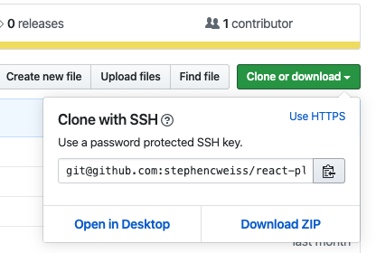

When you pull a repository down (i.e. clone it) from a remote (like Github, Gitlab, or a private host), git will automatically add it as a remote.

This is how `git pull`, `git push`, etc. are used to keep the repositories in sync.

What happens, then, when you need a second remote? This is a fairly common situation actually, particularly in open source development.

Imagine the following common situation:

1. You find a great open source library
2. You notice that there’s something you’d like to see added
3. You fork the project
4. You pull it down locally, and you make the changes
5. Now, you’re ready create a pull request, but the original master has changed, and you have conflicts.

What do you do?

Because you created a fork, when you cloned the repo, the remote points to your fork fork, not the original repo. That's normally a good thing since it means that you push changes up to your repo, not the original one. After all, you forked it. Divergences are to be expected. But now you want to propose changes and you can't!

The answer is simple: add a _second_ remote repo! That will allow you to pull the changes that are now creating conflicts and handle them locally. (There’s no limit to how many remotes you can have, though it probably makes sense to limit them to forks of the same project.)

## Confirm Your Remotes

Before you add a new remote repository, let’s confirm the current remotes:

```shell
$ git remote -v
origin	https://github.com/myUser/example.git (fetch)
origin	https://github.com/myUser/example.git (push)
```

## Add A Remote

Adding a remote is straightforward:

```shell
$ git remote add upstream https://github.com/*ORIGINAL_OWNER*/*ORIGINAL_REPOSITORY*.git
```

A few notes:

1. There’s nothing special about “upstream” - this could be called whatever you want. So, if you did `git remote add ridiculous …` when you do a pull later, you would do it with `git pull ridiculous master`
2. The URL (https://<…>.git) can be found in the “Clone or download” button on Github. You can use either SSH or HTTPS
   

## Verify Your Remote(s)

After setting the remote, you can make sure that it set properly:

```shell
$ git remote -v
origin	https://github.com/myUser/example.git (fetch)
origin	https://github.com/myUser/example.git (push)
upstream	https://github.com/someoneElse/example.git (fetch)
upstream	https://github.com/someoneElse/example.git (push)
```

In this situation you have _two_ remotes -

- One for myUser which you can interact with through the reference alias of `origin`
- One for the original project’s repo, which you’ve named `upstream`

## Pulling Upstream Master

Now that you have another remote repository, you can pull down the latest in the same way that you’d pull `origin`, except that you need to specify it because `origin` is the default, and `upstream` (or `ridiculous`) is not.

```shell
$ git pull upstream master
```

(In our case, this means that you could now handle the conflicts locally and then push up a resolved branch for review.)

## Pulling Upstream Branches Other Than Master

What if, instead of changes to master that were creating conflicts, you actually noticed another branch that you wanted to incorporate? That is, you noticed someone else was working on a branch that had not been merged into the upstream master (yet). (Let's call that the `target` branch).

How would you pull _that_ branch down? Well, you’ve already set up the remote, so now you just need to [pull down a remote branch](../../2019-04-27/git-checkout-remote-branch/).

## Footnotes

[Configuring a remote for a fork - GitHub Help](https://help.github.com/en/articles/configuring-a-remote-for-a-fork)
