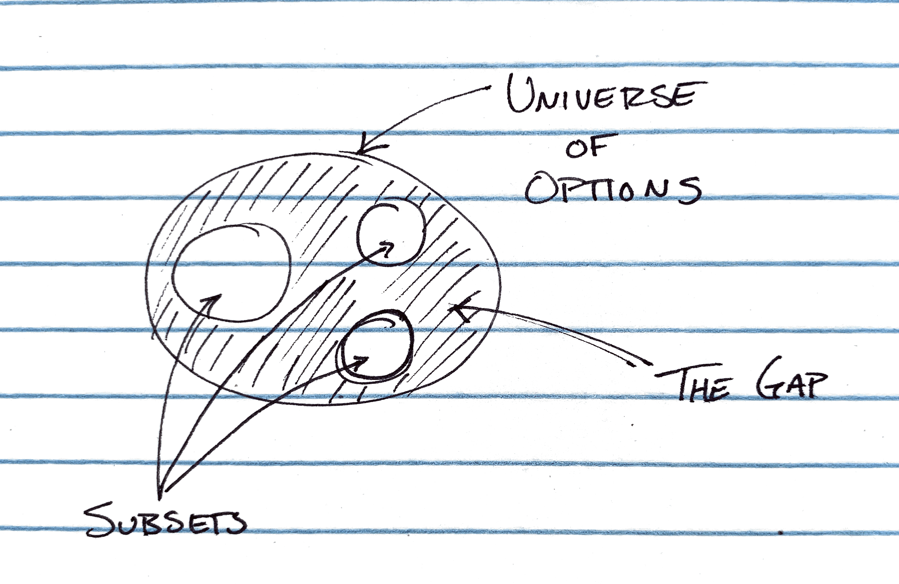

I want to highlight one way to create a subset of data. To get us started, let’s think about a universe of data. It’s a circle. Everything within that circle is catalogued and stored within a main object. We’ll call it `universe`.

We also have broken off smaller parts of the universe in the past. We’ll call these `subsets`.

Today, however we don’t care about the `subsets` or the `universe`. Instead, we want to use everything else. We’ll call this set of data, the `gap`.

At a high level then, we want an efficient way of creating this new, oddly shaped, subset.

The steps might be summarized as:

1. Get the list of all entries in the `universe`
2. Remove all entries that appear in `subsets`
3. Create a _new_ object that has just those keys (`gap`) instead of mutating the `universe`

If you’re just want the code, I put together a [CodeSandBox](https://codesandbox.io/s/universes-subsets-ts-ubh3n).

First - our data:

```javascript
const universe = {
  a: { name: 'a' },
  b: { name: 'b' },
  c: { name: 'c' },
  d: { name: 'd' },
  e: { name: 'e' },
}

const subset1 = [{ name: 'a' }, { name: 'd' }]
const subset2 = [{ name: 'e' }]
```

In this particular case, the data types are actually different. Our `universe` is a single large object where the key is the name. In this simplified example, it looks pretty unnecessary, but you can also imagine that there are many other attributes in a single object (i.e., `a` is not just an object with a name, but `{name: ‘a’, arms: 2, weight: 200, height: 6’6"}.`, etc.).

On the other hand, the `subsets` are Arrays where we have _just_ the objects.

The first thing we want to do is combine _all_ of the `subsets` into one single one:

```javascript
const subsets = [...subset1, ...subset2]
```

At this point, on the one hand we have the entire `universe` of data. On the other - we have all of the `subsets` combined. All that’s left is finding the `gap` between them.

We don’t want to _change_ the `universe`, so let’s first create a `Set` of _just_ the identifiers for each element of the `universe`:

```javascript
const allNames = new Set(Object.keys(universe))
```

The `Set` is not strictly necessary, however, it offers two advantages over just a new looking at the `Object.keys`:

1. It guarantees no duplicates
2. It provides an optimized `delete` method…

So, let’s make use of the `delete` shall we?
For every item that exists in a subset, we want to delete it from our list of `allNames`:

```javascript
for (const item of subsets) allNames.delete(item.name)
```

At this point, `allNames` is _almost_ our `gap` — it’s the list of names for every item that is _in_ the `gap`… we just need to get the details.

So, let’s build that now:

```javascript
const gap = Object.fromEntries(
  [...allNames].map(name => [name, universe[name]])
)
```

This was my first interaction with `Object.fromEntries`, but as MDN mentions, it’s really just the inverse of `Object.entries`.</sup>1</sup> When you think about it, that makes a lot of sense. Instead of destructuring an object into an array of tuples, the `Object.fromEntries` creates a new object from an array of tuples.

To make sure that our our new `gap` has the same shape as the `universe`, but only with the elements we want, we _first_ map over the `allNames` Set (which first is converted into an Array) and _then_ create the tuple `[name, universe[name]]`, which will finally be used to create the key:value pair in our new `gap` object.

## Conclusion

It’s always fun to find new ways and patterns for accomplishing your goals. Today, that meant learning more about `Sets` and methods like `Object.entries`.

What are you learning today?

## Typescript Notice

If you’re using Typescript, you will need to confirm that your `.tsconfig` has the `downLevelIteration` set to `true`.<sup>2</sup> You will also likely need to import some of the more modern libs (e.g., `esnext` as `Object.fromEntries` and `for ... of` loops are relatively recent additions. Alternatively, you could replace these with `subsets.forEach(/* ... */)` and `Array.from(allNames)`.

## Footnotes

- <sup>1</sup> The [MDN Page on Object.fromEntries](https://developer.mozilla.org/en-US/docs/Web/JavaScript/Reference/Global_Objects/Object/fromEntries) states: "Object.fromEntries() performs the reverse of [Object.entries()](https://developer.mozilla.org/en-US/docs/Web/JavaScript/Reference/Global_Objects/Object/entries) ."
- <sup>2</sup> Marius Schulz put together a fantastic post explaining the `—downlevelIteration` flag in Typescript and it’s role in `for…of` loops
