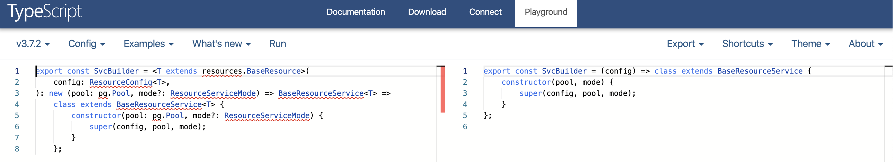

I came across the following function in a codebase today and struggled to see what was happening - the combination of classes with typescript was just too much to process today.

```typescript
export const SvcBuilder = <T extends resources.BaseResource>(
  config: ResourceConfig<T>
): new (pool: pg.Pool, mode?: ResourceServiceMode) => BaseResourceService<T> =>
  class extends BaseResourceService<T> {
    constructor(pool: pg.Pool, mode?: ResourceServiceMode) {
      super(config, pool, mode)
    }
  }
```

In particular, I couldn’t quite place what `new (pool: pg.Pool, mode?: ResourceServiceMode)` applied to.

I struggled to write my own pure JS function for a while, but kept running into trouble. Eventually I remembered the [Typescript Playground](https://www.typescriptlang.org/play/). It’s a site that will show Typescript code side-by-side with the vanilla JS it compiles down into.



Hopefully next time I remember a little faster so as to not spend so much time before getting to the answer!

For what it's worth - it was referring to the signature of _instantiating_ the returned class. The more you know!
