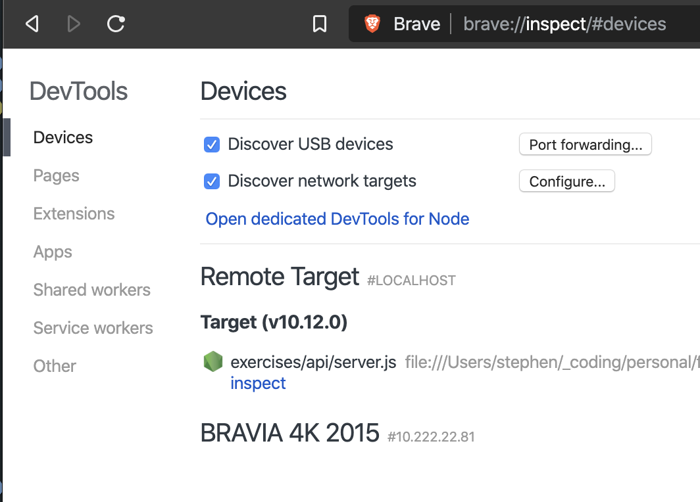
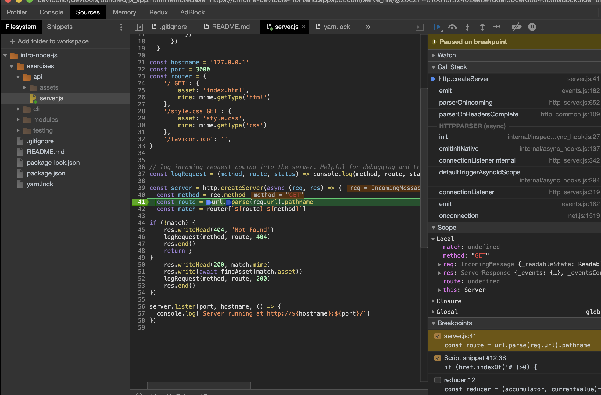

If you’re running a node application and you want to debug, but don't want to use the debugger in your text editor, perhaps your text editor doesn't have a debugger, or maybe you just miss the Chrome dev tools, there's a solution: use the `--inspect` flag.

The steps:

1. Start your `node` app with the `—-inspect` flag. So, if you normally start your app with `node app.js`, not it’s `node --inspect app.js`

You should see a print out similar to the following:

```shell
Debugger listening on ws://127.0.0.1:9229/448f8b66-e314-4a23-ba69-e7b6eff31e7b
For help, see: https://nodejs.org/en/docs/inspector
Server running at http://127.0.0.1:3000/
```

What this is saying is that my app is now running on port 3000, just like usual, but also that the debugger is listening on a web socket at port 9229.

2. On a Chromium browser, go to `//inspect`. That would be `chrome://inspect` or `brave://inspect` if you’re on Brave, etc.

You should now see a screen that looks like this:



3. Click “inspect” and it will open a DevTools window.

Note - you _may_ need to manually add the filesystem (go to Source and select “Add folder to workspace”).

Once your files are loaded, however, you have full debugging features available.


