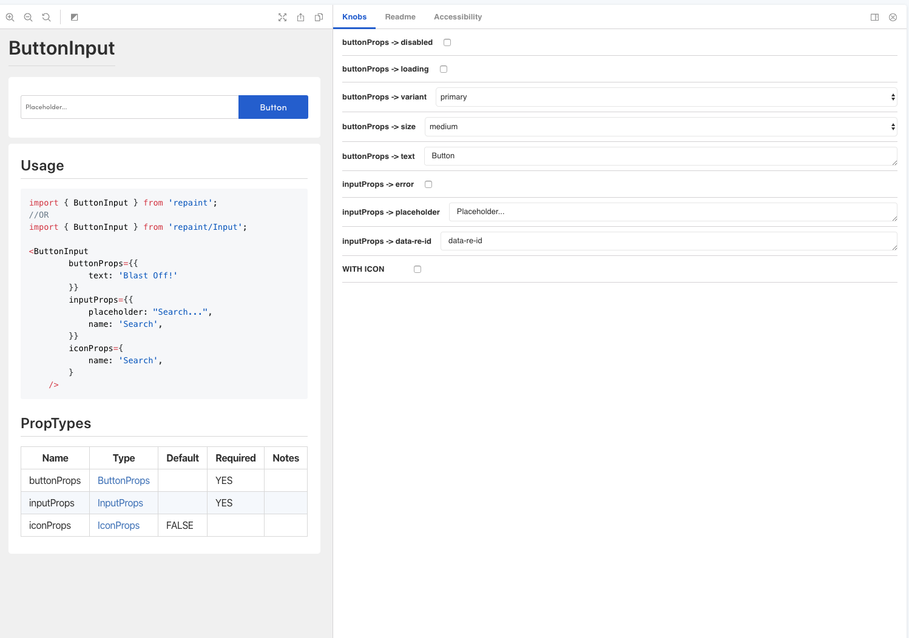
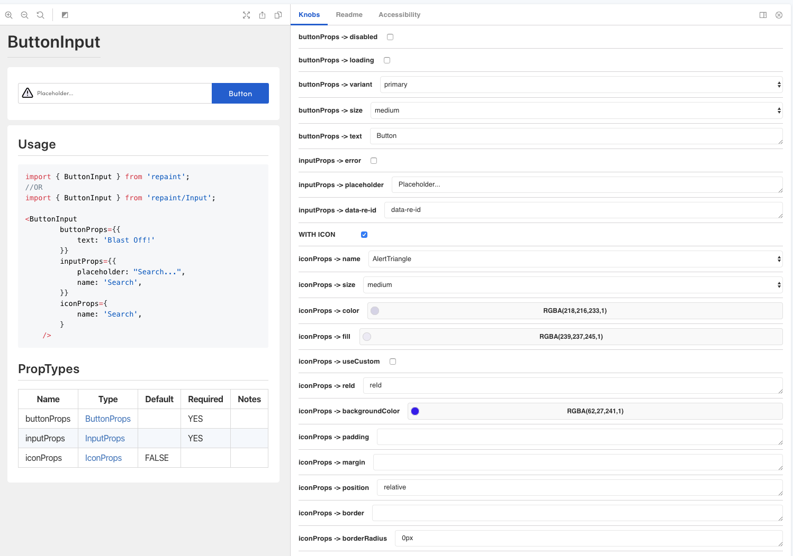

I'm a big fan of Storybook JS. It makes sharing what's possible with a React component trivial.<sup>1</sup>

There is a potential problem though: when components take a huge number of props, the Information Pane (specifically the Knobs tab) can become overwhelming.

I recently came across an elegant solution to the problem written by my colleague, [Matteo Stohlman](https://github.com/MatteoStohlman).

Before getting to the solution, let's see _why_ this can be a problem with an example.

## Numerous Options: A Composite Component

There's not limit to the number of props a component can receive and this problem is only magnified when a single component pulls together multiple smaller ones.

We call this patter a composite at Remine. One example of a composite component is our `ButtonInput`.

The `ButtonInput` does exactly what it sounds like (with a twist): it ties an `<input>` together with a `<button>`. The twist is the optional `<Icon>` component, a wrapper around the `react-fontawesome` component, that can be placed _inside_ the `<input>`.

From a high level, the propTypes for `ButtonInput` are:

| Name        | Default | Required | Notes |
| ----------- | ------- | -------- | ----- |
| buttonProps |         | YES      |       |
| inputProps  |         | YES      |       |
| iconProps   | FALSE   |          |       |

All of these props are objects and their definitions are determined by our `<Button>`, `<Input>`, and `<Icon>` components (the details of which don't matter much at the moment).

The default `ButtonInput` looks like this:


But, if iconProps are passed through, the icon is rendered within the the `<input>` box and the `placeholder` text (and `value`) of the `<input>` are pushed to the right. For example:



## Configuring Storybook To Conditionally Show Options

As a wrapper of `react-fontawesome`, `<Icon>` can take a number of [props](https://github.com/danawoodman/react-fontawesome/blob/HEAD/api.md), but because it's optional, it's better to not clutter up the `Knobs` pane unnecessarily.

Looking at the Knobs pane, we see a `WITH ICON` option. This is _not_ a real prop, but is used to hide all of the props related to `iconProps` if they're not needed.

To set this up, we can use the `boolean` knob to conditionally show all of the options.

For example, here's the story for `ButtonInput`

```javascript
import { storiesOf } from '@storybook/react';
import { boolean, text, select, color } from '@storybook/addon-knobs';
...

storiesOf('Input/ButtonInput', module)
    .addParameters({
        readme: {
            content: Readme,
        },
    })
    .add('default', () => (
        <ButtonInput
            buttonProps={{
                disabled: boolean('buttonProps -> disabled', false),
                loading: boolean('buttonProps -> loading', false),
                variant: select('buttonProps -> variant', BUTTON_VARIANTS, 'primary'),
                size: select('buttonProps -> size', SIZE_OPTIONS_MAPPED, 'medium'),
                text: text('buttonProps -> text', 'Button!'),
                onClick: () => alert('so clicky!!'),
            }}
            inputProps={{
                onChange: props => console.log(props),
                error: boolean('inputProps -> error', false),
                placeholder: text('inputProps -> placeholder', 'Placeholder...'),
                name: 'Search',
                'data-re-id': text('inputProps -> data-re-id', 'data-re-id'),
            }}
            iconProps={
                boolean('WITH ICON', false) && {
                    name: select('iconProps -> name', ICON_OPTIONS, 'Circle'),
                    size: select('iconProps -> size', EXTRA_SIZE_OPTIONS_MAPPED, 'medium'),
                    color: color('iconProps -> color', undefined),
                    fill: color('iconProps -> fill', undefined),
                    useCustom: boolean('iconProps -> useCustom', false),
                    reId: text('iconProps -> reId', 'reId'),
                    backgroundColor: color('iconProps -> backgroundColor', undefined),
                    padding: text('iconProps -> padding', undefined),
                    margin: text('iconProps -> margin', undefined),
                    position: text('iconProps -> position', 'relative'),
                    border: text('iconProps -> border', ''),
                    borderRadius: text('iconProps -> borderRadius', '0px'),
                }
            }
        />
    ));
```

## Conclusion

Using Storybook is a great way to communicate what is possible. That doesn't mean you should just throw the kitchen sink at anyone who's looking though.

Using a conditional flag like the `WITH ICON` in our example above can dramatically simplify the experience. Just be sure to make it clear that `WITH ICON` is not a prop itself!

## Footnotes

<sup>1</sup> Apparently Storybook has extended beyond just supporting React. Great news should I ever venture out since I love the tool for its ability to communicate what's possible.
