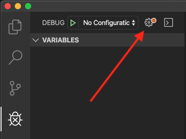
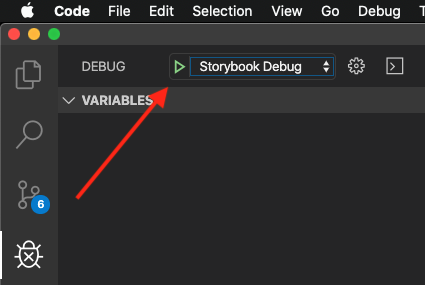
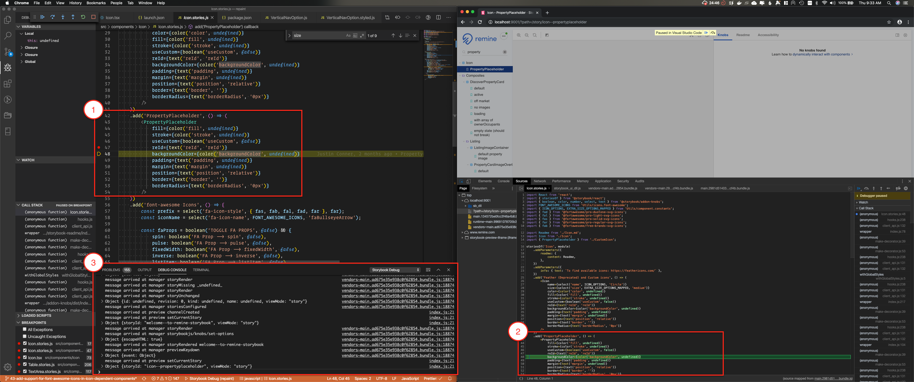

While Storybook is great for communicating the potential of different components, debugging issues with components can be more of a challenge.

Using the Storbyook stack trace is challenging due to the number of anonymous functions invoked by Storybook to get things up and running.

Fortunately, it's possible to configure VSCode to run the debugger on Storybook through the [Debugger for Chrome](https://marketplace.visualstudio.com/items?itemName=msjsdiag.debugger-for-chrome) extension.

Setting up debuggers in VSCode is always challenging for me, so I decided to document the process to speed up the process in the future, act as a reference for anyone else who might want to debug Storybook and note one potential issue with breakpoints (and the solution).

## Setting Up The Debugger

While it'd be lovely if things "just worked", VSCode requires that we configure our debuggers (it needs to know what it's debugging after all).

In this case, we'll be using the Debugger for Chrome, so that's our first step.

If it's not already installed, head over to the Extensions pane (`Cmd ⌘ + Shift ⇧ + X`) and download it now by searching for "Chrome":


Once that's done, we can open the `launch.json`. This can be done using the Command Palette (`Cmd ⌘ + Shift ⇧ + P`), by searching for `launch`:


Alternatively, in the Debugger pane (`Cmd ⌘ + Shift ⇧ + D`), click on the "Gear" icon:


Now that the `launch.json` should be open, we can add a configuration object to the `"configurations"` array:

```json
{
  // Use IntelliSense to learn about possible attributes.
  // Hover to view descriptions of existing attributes.
  // For more information, visit: https://go.microsoft.com/fwlink/?linkid=830387
  "version": "0.2.0",
  "configurations": [
    {
      // Requires the extension Debugger for Chrome: https://marketplace.visualstudio.com/items?itemName=msjsdiag.debugger-for-chrome
      "type": "chrome",
      "request": "launch",
      "name": "Storybook Debug",
      "breakOnLoad": true,
      "url": "http://localhost:9001",
      "sourceMaps": true,
      "webRoot": "${workspaceFolder}",
      "sourceMapPathOverrides": {
        "webpack:///*": "${webRoot}/*",
        "webpack:///./*": "${webRoot}/*",
        "webpack:///src/*": "${webRoot}/*",
        "webpack:///./~/*": "${webRoot}/node_modules/*"
      }
    },
  ]
}
```

This configuration is based on [@kresli](https://github.com/kresli)'s answer on the [Storybook issue I found related to debugging](https://github.com/storybookjs/storybook/issues/1754).

The most important change is related to the url which needs to match the port the application is configured to run Storybook on. In my case, that's `9001` (which ties to the `npm script` I have for Storybook).

## Using The Debugger

Now that the debugger is configured, we're almost ready to use it.

Before we can, however, there's one last step: start Storybook.

If it's not running, the debugger will launch a Chrome window and try to hit port 9001 on localhost and receive no data.

Once Storybook is running, go into VSCode to the Debugger pane, select the `Storybook Debug` (the name comes from the `launch.json` configuration) from the drop down, and press the play button.



Once it's up and running, you should be able to:
1\. Pause on Breakpoints
2\. See see your source map in Chrome
3\. See the output in the Debug Console



## Known Issues (And Solutions)

The first time I ran my debugger it was using @kresli's solution and while outputs were logged within my Debug Console in VSCode, the debugger didn't stop on the breakpoints I'd set.

It turns out that this is a known issue with the Chrome Debugger and Microsoft has outlined a workaround and a fix.

The workaround is simply to allow the app to load the first time with the debugger and then refresh the page.

> If your breakpoints aren't hit, it's most likely a sourcemapping issue or because you are having breakpoints in immediately executed code. If you for example have a breakpoint in a render function that runs on page load, sometimes our debugger might not be attached to Chrome before the code has been executed. This means that you will have to refresh the page in Chrome after we have attached from VS Code to hit your breakpoint.
>
> Source: <https://github.com/Microsoft/vscode-chrome-debug#my-breakpoints-arent-hit-whats-wrong>

The solution is to use the `breakOnLoad` flag in the configuration (which I've included in the above example).

`breakOnLoad` is an experimental feature and can have performance implications. That said, I like it for ensuring that my debugging behaves as expected and I don't run around in circles trying to figure out why it's not stopping at breakpoints.

Given that I don't debug that often, when I do, I want it to work, and I'll take the performance hit (which I'll note has not been noticeable so far).

## Alternative Options

While the VSCode approach worked for me, another option to investigate is the Storbyook add-on for [Console](https://github.com/storybookjs/storybook-addon-console).

Even beyond the debugging requirements I had, this is useful if you don't want to keep a console window open at all times.

Storbyook has provided a [live demo](https://storybookjs.github.io/storybook-addon-console/?path=/story/*) as well.
