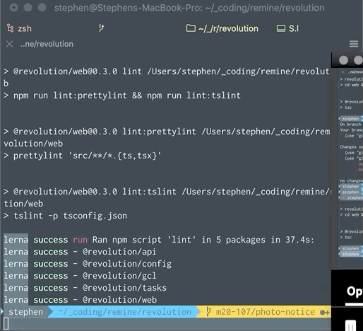

When a terminal window gets busy, sometimes, it's nice to make a little breathing so that it's easier to see what's going on.

There are a few different ways to do this:
1. Add new lines
2. Use the built-in "Clear to start" or "Clear to previous mark
3. Run `clear`


## Adding New Lines

This is the easiest solution. When the terminal window gets full, just press enter or `CTRL (⌃) + C` (exiting the process, even if there is not one running), until the previous print out is above the fold.


## Run Built-In Clear Commands

[There are many useful keyboard shortcuts for the terminal on MacOS](https://support.apple.com/guide/terminal/keyboard-shortcuts-trmlshtcts/mac) (which work in iTerm2 as well).

In this case, two that are particularly useful are:
1. "Clear to start" (`CMD (⌘) + K`)
2. "Clear to previous mark" (`CMD (⌘) + L`)

For a long time, "Clear to start" has been my go to. It is like opening a brand new terminal but without losing any of the context.

## Run Clear

When I watch other people work - whether they're colleagues or instructors for a course I'm taking - I am always surprised by the prevalent use of the `clear` utilit.

In the UNIX tradition, it does _one thing_. From the manual page:
> NAME
>        clear - clear the terminal screen
>
> SYNOPSIS
>        clear
>
> DESCRIPTION
>        clear clears your screen if this is possible.  It looks in the environ-
>        ment for the terminal type and then in the terminfo database to  figure
>        out how to clear the screen.
>
>        clear ignores any command-line parameters that may be present.
>
> SEE ALSO
>        tput(1), terminfo(5)
>
>        This describes ncurses version 5.7 (patch 20081102).

```shell
$ clear
```



## New Preference For Clear

I decided to try `clear` and found I actually prefer it. Why? Because while it _does_ provide the same clean terminal feel as "Clear to start", it does so _without_ clearing history.

As a result, when running clear, I can "scroll up" to see the previous logs.

Not losing history in the event that I may need it seems like a benefit worth paying with three extra characters.


