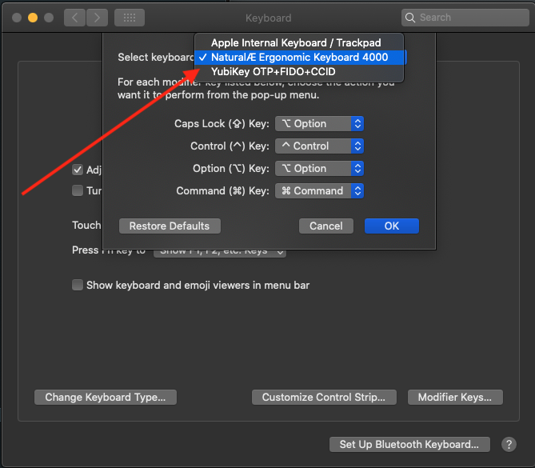

Googling how to remap a keyboard's keys provides a ton of answers, but most of the resouces I found suggested a software solution.

While software is likely more powerful and may be appropriate if you want to completely redo your keyboard layout, all I really wanted to do was add an Option (`⌥`) key to my Microsoft [Natural Ergonomic Keyboard 4000](https://www.microsoft.com/accessories/en-us/products/keyboards/natural-ergonomic-keyboard-4000/b2m-00012).

As it turns out this is doable from within System Preferences on MacOS.

1. Open System Preferences > Keyboard
2. Select "Modifier Keys..."

3. Select the keyboard

4. Change the keys as desired

In my case, I don't need a Caps Lock `⇪`, but use the Option `⌥` key for many shortcuts, so I replaced the Caps Lock `⇪` Key with the Option functionality.

NB: While this works for _most_ situations, some things like opening a minimized window through the Cmd `⌘` + Tab `⇥` Application Switcher (and then Cmd `⌘` + Option `⌥` on the minimized application) doesn't seem to work.

## Resources

These steps were originally found on [Beebom.com](https://beebom.com/how-remap-windows-keyboards-work-mac/).
