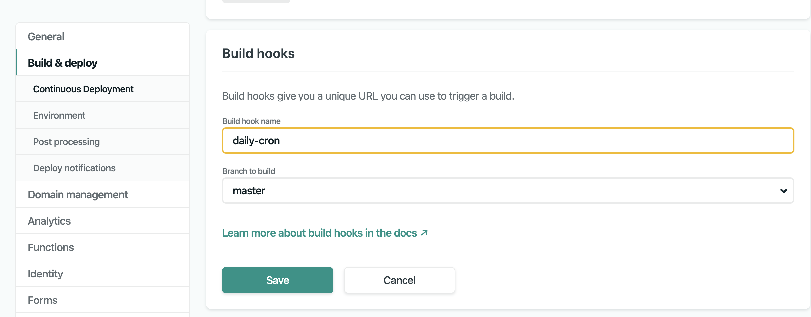

I wrote previously about [setting up a simple embargo](../../2019-10-16/gatsby-simple-embargo) on my Gatsby site in the past. Even when I first implemented it, however, I knew that there'd be a better solution in the future.

As a reminder: Gatsby sites are static. In my case, the buiilds included all of the posts for my blog. Consequently, when I wrote a post and added it to my site - when the site built it was visible.

The purpose of the embargo was to create space between when I wrote a new post and when it would appear. The original solution solved this by simply hiding the posts on the front end. I wanted a better solutiion however. For that, I reached for an old standby: the cron job.

## What Is A Cron Job

Cron is a uility that is used for scheduling commands or programs to execute at a specific time. Named for Chronos, the diety of time, these scheduled commands are referred to as "Cron Jobs".

Common uses of cron jobs include backups, monitoring, and maaintenance.

The syntax for cron jobs is a little peculiar, but there's a logic to it that just takes some familiarity:

```shell
 ┏━━━━━━━━━━━━ minute (0 - 59)
 ┃ ┏━━━━━━━━━━ hour (0 - 23)
 ┃ ┃ ┏━━━━━━━━ day of month (1 - 31)
 ┃ ┃ ┃ ┏━━━━━━ month (1-12)
 ┃ ┃ ┃ ┃ ┏━━━━ day of week (0 - 6) or use names;
 ┃ ┃ ┃ ┃ ┃       0 and 7 are Sunday, 1 is Monday,
 ┃ ┃ ┃ ┃ ┃       2 is Tuesday, etc.
 ┃ ┃ ┃ ┃ ┃
 * * * * * <command to execute>
```

Some great examples of different schedules can be found on [ostechnix.com](https://www.ostechnix.com/a-beginners-guide-to-cron-jobs/).

## Netlify Build Hooks

Now that we know a bit about cron jobs, we want to talk about which command to execute.

In this particular case, we'll be using [Netlify Build Hooks](https://docs.netlify.com/configure-builds/build-hooks/#app) as I'm using Netlify to build and deploy my site.

Triggering a build requires only a POST request sent to the URL specified by a token.

To add a build hook, we log into Netlify, select the site and choose Settings.

Then, on the left, select "Build & Deploy" and scroll down to "Build Hooks". Select "Add build hook". From here, we can name the hook.



Once saved, Netlify will produce a token we can use to trigger a build. The token should be considered sensitive and should be kept private (similar to an API key).


Now that we have a build hook, we need to schedule the invocation of it. For that, we'll use a cron job via GitHub Actions.

## GitHub Actions

Recently out of a beta, [GitHub Actions](https://github.com/features/actions) are a new feature from Github to automate software workflows.

To get the action set up, we will need to:

1.  Add a workflow `.yml`
2.  Add the secret

### Adding GitHub Workflows

Github actions are managed by the presence of a `.yml` file in a directory in your project `.github/workflows/<action-name>.yml`.

Here's the my `nightly-build.yml` file:

```yaml
name: Daily Build
on:
  schedule:
    - cron: ‘0 8 * * *’ # 0 minute, 8th hour, every day of the month, every month, every day of the week (UTC)*
jobs:
  build:
    runs-on: ubuntu-latest
    steps:
      - name: Trigger Netlify Build Hook
        run: curl -s -X POST -d {} “https://api.netlify.com/build_hooks/${TOKEN}”
        env:
          TOKEN: ${{ secrets.NETLIFY_DAILY_CRON_HOOK }}
```

Remember that a cron job has two parts: a schedule and a command. In this yaml file, I've defined a schedule as the 0th minute of every 8th hour, every day of th month, every month, and every day of the week.<sup>1</sup> The job is to run the `curl` and send the POST to Netlify.

Two things to note:

1.  Regarding yaml files generally: they're space sensitive. My first attempt resulted in an error, "YAML mapping values are not allowed in this context". Investigating it led me to this [StackOverflow conversation](https://stackoverflow.com/questions/31313452/yaml-mapping-values-are-not-allowed-in-this-context) and ultimately <http://www.yamllint.com/> - a great tool for validating yaml files.
2.  The `curl` is the same as what Netlify suggested - though I spefcified a TOKEN which takes a value `secrets.NETLIFY_DAILY_CRON_HOOK`. That secret hasn't yet been defined. In fact, that's the final step.

## Adding A Secret

Though we've referenced a variable in our `.yml` file, we now need to define it.

To do so, in the repository, select settings and then "Secrets" on the left.


In this case, the secret is taken directly from Netlify as the string that follows `/build_hooks/`.

## Conclusion

And with that, I have a new build process. Suddenly, my website builds every day at 8am which frees me to focus on the parts of writing and running this site that I enjoy and begin to automate the other stuff.

## Footnotes

-   <sup>[1](#fn1)</sup> Though it's scheduled at 8am, it's important to remember that the time is local to the computer _running_ the command. In this case, that means wherever the Netlify servers are. =

## Resources

Additional resources that I found helpful include:

-   [Scheduling Netlify Deploys With Github Actions | Voorhoede](https://www.voorhoede.nl/en/blog/scheduling-netlify-deploys-with-github-actions/) - This was a great tutorial that proved a great starting point to understanding these actions.
-   [About GitHub Actions - GitHub Help](https://help.github.com/en/articles/about-github-actions)
-   [Automating your workflow with GitHub Actions - GitHub Help](https://help.github.com/en/categories/automating-your-workflow-with-github-actions)
-   [Events that trigger workflows - GitHub Help](https://help.github.com/en/articles/events-that-trigger-workflows)
-   [Automate your Netlify sites with Zapier | Netlify](https://www.netlify.com/blog/2018/11/07/automate-your-netlify-sites-with-zapier/)
