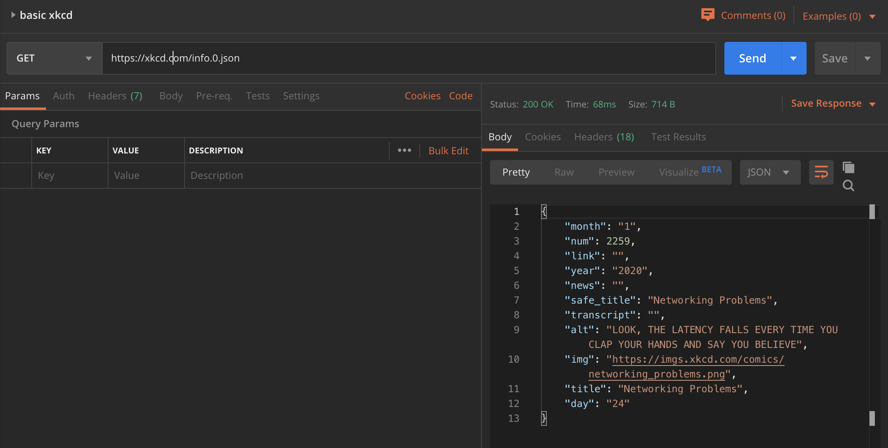

I love [Randall Munroe's XKCD](https://www.xkcd.com), but going to his site every day is potentially problematic because it's so easy to get sucked down the rabbit hole of clicking "random" over and over and over.

At the same time, he's been writing comics for years and I haven't kept up. I wondered if there wasn't some way that I could pull five, _just five_ images into my site every day for a digest of sorts.

Over time I would catch up, but I wouldn't have to worry about fighting the gravitational pull that is XKCD.com.

So, I set about building this (which is live on this site at `/xkcd`)

Some of the decisions I made up front on how the page would look and interact:
1. Comics would have the Title and the Image, nothing else displayed (similar to XCKD's native experience, however with fewer buttons)
2. The carousel would navigate through five, "randomly" chosen comics
3. To avoid the temptation of hitting the refresh button to get a _different_ five, the randomness would be limited to the _day_ of viewing.

The building process turned out to be quite informative and full of stumbling blocks.

Below, I highlight a few of them and the final result.


## Getting Images

Step one to building this gallery was to actually be able to get the images. Here's where I hit my first stumbling block.

The [XKCD site has a page dedicated to programmatic access](https://xkcd.com/json.html) of comics.

Seems straightforward enough. I tested the end point in Postman.



Voila.

Unfortunately, this site is built on Gatsby, a statically site generator. One consequence of this is that I do not have access to a server in the traditional sense.

This is problematic only in that when I tried to make the same API call from the client, I received a CORS error.

```javascript:title=./pages/xkcd.jsx
function XKCDGallery() {
  fetch(`https://xkcd.com/info.0.json`)
    .then(res => res.json())
    .then(res => console.log(res))
    .catch(error => console.error(`oh no -> `, error))

  return (/* ... */)
}
```

Returned the console error:

```shell
> Access to fetch at 'https://xkcd.com/info.0.json' from origin 'http://localhost:8000' has been blocked by CORS policy: No 'Access-Control-Allow-Origin' header is present on the requested resource. If an opaque response serves your needs, set the request's mode to 'no-cors' to fetch the resource with CORS disabled.
> index.js:2177 oh no ->  TypeError: Failed to fetch
```

I tried multiple different configurations on my request call. I tried JSONP. Nothing seemed to work.

Based on everything I read, in order for this to work, I'd need access to XKCD's servers to white list my IP or allow cross origin requests.

Since _that_ wasn't going to happen, I needed an alternative solution. This is where [Nicolas Marcora](https://twitter.com/NicolasMarcora) jumped in to save the day and pointed me to [`cors-anywhere`](https://www.npmjs.com/package/cors-anywhere).

_A_ solution is to simply use the demo<sup>[1](#footnotes)</sup><a id="fn1"></a>:

```javascript:title=./pages/xkcd.jsx
function XKCDGallery() {
  const proxyUrl = 'https://cors-anywhere.herokuapp.com'

  const proxiedRequest = (url, options = {}) =>
    fetch(`${proxyUrl}/${url}`, {
      ...options,
      headers: {
        ...options.headers,
        'X-Requested-With': 'wololo',
      },
    })
    .then(resp => resp.json())
    .then(res => console.log({comic: res}))
    .catch(error => console.error(`oh no --> `, error))

  const proxiedGet = url => proxiedRequest(url)

  proxiedGet('https://xkcd.com/info.0.json')

  return (/* ... */)
}
```


Whew! I now have results. I can proceed to the next step!

## Predictable Results

One of the quirks I introduced in my design was that I wanted to be able to get the _same_ images every time I hit the page for an entire day.

That meant I couldn't just use `Math.rand()` to pull down five images. So, how _could_ I do this?

Hashing!

When I first learned about hashing functions, my mind was blown. The quick summary is that they reliably transform data to always get to the same result. The variables are the input and the size of the hash. If you know that (and the hashing function), you can derive the answer.

Notably, this is _not_ encryption. It can be reversed. There's no concept of a public/private key.

A simple hashing function might look like this:

```javascript
function hash(str) {
  let hash = 0
  if (str.length === 0) return
  for (let i = 0; i < str.length; i += 1) {
    let char = str.charCodeAt(i)
    hash = (hash << 5) + hash + char
    hash = hash & hash // Convert to 32bit integer
    hash = Math.abs(hash)
  }
  return hash
}
```

This is one I have kept around from a course I took a while back, but it turns out to be a fairly common one. In researching hashing functions I found this post on [http://mediocredeveloper.com](/wp/?p=55) which walks through each step of a nearly identical function.

Armed with a hashing function, I now needed to _bound_ it. If I didn't, when I requested a comic, it might not exist.

Randall is prolific, but he's not written an infinite number of comics.

In fact, we actually already discovered the total number of available comics. The proxied request above was for the most recent comic, but in the body of the response, we see the `num` property. This turns out to correspond to the sequential indicator Randall has chosen to identify his comics.

With that information, we can write another function to make sure that we stay between 1 and the maximum.
```javascript
function boundedHash(str, max = 100) {
  let hashedVal = hash(str)
  return Math.max(hashedVal % max, 1)
}
```

A few quick notes about this implementation:
1. I'm okay with conflicts. This is a fun project and if I get a collision (i.e. two different hashes that end up occupying the same value), then I'll see the comic twice.
2. The `Math.max` is an error guard as trying to find the comic with `num = 0` will throw an error. I could swallow this later, however, again, for the purposes here, this is acceptable.

## Encapsulating The Logic In A Hook

At this point, I have all the pieces I need to actually retrieve a number of images. Can I do it in a way that makes consuming them in a component relatively painless?

Normally best practice is to extract reusuable hooks and it's _very_ unlikely that I will reuse this hook elsewhere. However, I decided to extract it anyway. Why? Because it keeps my view component logic _very_ simple.

```javascript:title=./hooks/useXkcd.jsx
import {useAsync} from 'react-use'
import { boundedHash } from '../utils/hashFn'
import { proxiedGet } from '../utils/proxiedrequest'
import { TODAY } from '../constants'

/**
 * Details re: XKCD's JSON: https://xkcd.com/json.html
 *  */
export function useXkcd({ comicQty }) {

  async function latestComicNumber() {
    return await proxiedGet('http://xkcd.com/info.0.json')
      .then(res => res.json())
      .then(res => res.num)
  }

  async function fetchRequestedImages(comicQty) {
    const maxComic = await latestComicNumber()
    const images = []
    images.push(fetchComic()) // get the current comic
    for (let i = 0; i < comicQty; i += 1) {
      const img = fetchComic(boundedHash(i + TODAY, maxComic))
      images.push(img)
    }
    return images
  }

  async function fetchComic(comicId) {
    return proxiedGet(
      `http://xkcd.com/${comicId ? `${comicId}/` : ``}info.0.json`
    )
      .then(res => res.json())
      .then(res => {
        res.link = `http://xkcd.com/${comicId}` // Want to be sure to provide a way back to xkcd
        return res
      })
      .catch(error => console.error(`fetchComics --> `, error))
  }

  const {loading, error, value} = useAsync(() => {
    return fetchRequestedImages(comicQty).then(res => Promise.all(res))
  }, [])

  return {isLoading: loading, isError: error, xkcdComics: value}
}
```

What this hook does in a nut shell is:
1. Exposes a very simple surface area to the consumer: how many comics do you want back?
2. It handles all of the logic for fetching a collection that will match that request.
3. It wraps it all in a `useAsync` hook from `react-use` to make sure to communicate whether the data is ready to render or not.

How simple does that make my view component? Well, let's look:

```javascript:title=./pages/xkcd.jsx
export function XKCDGallery(props) {
  const { isLoading, isError, xkcdComics } = useXkcd({ comicQty: 5 })

  if (isError) {
    return <div>eek! an error!</div>
  }

  return (
    <Layout>
      <Title> XKCD Daily Digest </Title>
      {isLoading ? (
        <CenteredLoader />
      ) : (
        <ImageCarousel images={xkcdComics} />
      )}
      {/* ... */}
    </Layout>
  )
}
```

Pretty nice! This takes us to the final stage of the exercise - _displaying_ the data.

## Displaying The Comics

This posed yet another problem for me. My first attempt was to use the `pure-react-carousel` library, however, the results I was getting were hardly ideal (all images were rendered on a single slide).

[Sung M. Kim aka Dance2Die](https://sung.codes/) turned me onto [`nuka-carousel`](https://github.com/FormidableLabs/nuka-carousel) which turned out much better for me. It even has keyboard controls and by using a ref (thanks in no small part to Lee Warrick's article [React's useEffect and useRefs Explained for Mortals](https://leewarrick.com/blog/react-use-effect-explained/) I auto-focus _on_ the carousel, so keyboard controls are available as soon as the comics load.

There _is_ a lingering bug: the carousel doesn't reserve enough space in the DOM initially for the _first_ image. Once you move to the _next_ image, this is resolved. This bug bothers me, but it's also an opportunity to learn in the future. I'll be back to fix it soon I hope!

## Wrap Up

||
|:---:|
| Current state of the daily digest! |

Whew! That's all I've got for today. It's been a weird, wild ride but wow is it cool that I can wake up with an idea, spend a few hours thinking and tinkering, and with a little help from my friends build something that didn't exist before.

https://www.youtube.com/watch?v=0C58ttB2-Qg

## Footnotes
- <sup>[1](#fn1)</sup> I'm using the demo proxy for now, however, I plan to migrate to my own version of the cors-anywhere soon using that as a serverless function - that will be a learning experience in its own right! For now, I'm grateful for Rob W, the developer behind `cors-anywhere` and his demo environment.
