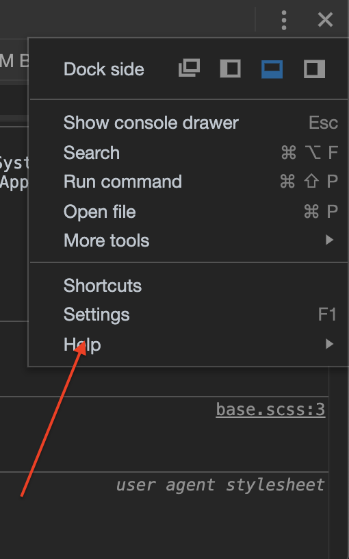

When debugging a website, I find myself frequently reaching for tools to convert between Hex, RGB, and HSL so that I can easily confirm if two colors are the same.

Chrome offers this conversion for free within their Dev Tool Settings (`F1`).

Once inside of settings, look for "Color Format" where you can pick between:
1. As authored
2. HEX
3. RGB
4. HSL

You can also do it by selecting the Color Picker from within Styles tab.

This will open a dialog window which allows for easy transformataion between the different styles.
