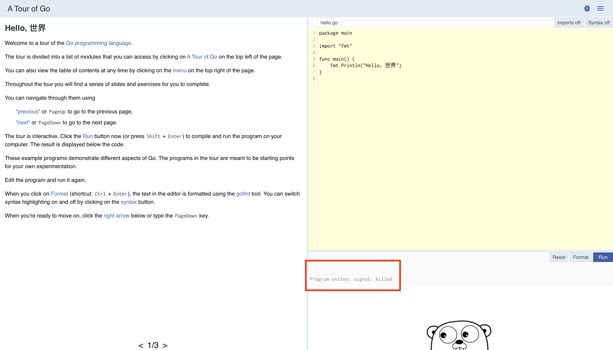

In [A Tour of Go](https://tour.golang.org/), one of the options is to run the tour offline.

The instructions seem simple enough:

1. Install Go
2. Run the command to fetch the tour

```shell
go get golang.org/x/tour
```

3. Run the binary that's placed in the workspace's `bin` directory.

First things first: `workspaces` seem to have been deprecated with the introduction of modules in v1.13+.<sup>[1](#footnotes)</sup><a id="fn1"></a>

Why does any of this matter? Because when I followed the instructions:

```shell
stephen@Stephens-MBP-2 ~ % go get golang.org/x/tour
stephen@Stephens-MBP-2 ~ % $HOME/go/bin/tour
```

The tour successfully downloaded, and I was able to run the binary... but, I couldn't execute anything.



Trying to run the `Hello, world`, I got the message: `Program exited: signal: killed`.

Womp, womp.

## Debugging The Issue

First, let's look at a few things:

1. The [instructions to install Go (on Mac)](https://golang.org/doc/install?download=go1.14.1.darwin-amd64.pkg) indicate that by following the wizard, `/usr/local/go/bin` should be automatically available in the `PATH`. Checking that, it appears that's true!

```shell
$ echo $PATH
/Users/stephen/.nvm/versions/node/v12.16.1/bin:/Users/stephen/.cargo/bin:/usr/local/bin:/usr/bin:/bin:/usr/sbin:/sbin:/usr/local/go/bin:/Users/stephen/.cargo/bin
```

2. But when I saved the tour (with the `go get`), where did that save and install? _Not_ in `/usr/local/go`, but `/Users/stephen/go` - this is because that's my `GOPATH` value:

```shell
$ go env
...
GOBIN=""
GOPATH="/Users/stephen/go"
GOROOT="/usr/local/go"
...
```

In my haste to get started, I didn't fully comprehend Go's [How to Write Go Code](https://golang.org/doc/code.html), specifically, in describing the installation of a `hello.go` it reads:

> ```shell
> $ go install example.com/user/hello
> $
> ```
> This command builds the `hello` command, producing an executable binary. It then installs that binary as `$HOME/go/bin/hello` (or, under Windows, `%USERPROFILE%\go\bin\hello.exe`).
> The install directory is controlled by the `GOPATH` and `GOBIN` [environment variables](https://golang.org/cmd/go/#hdr-Environment_variables) . If `GOBIN` is set, binaries are installed to that directory. If `GOPATH` is set, binaries are installed to the `bin` subdirectory of the first directory in the `GOPATH` list. Otherwise, binaries are installed to the bin subdirectory of the default `GOPATH` (`$HOME/go` or `%USERPROFILE%\go`).

What's all this mean? Well, it means that by default, the Go binaries will be saved in `/Users/stephen/go/bin`, (which is also often written as `$HOME/go/bin` or `~/go/bin`).

### Side Note: Simpler Go Execution
We can make executing Go binaries a much simpler process then by adding this to our [PATH](../../2020-04-15/path-variable-modifying), like so:

```txt:title=".zshrc"
...
export PATH="$PATH:$HOME/go/bin" # This adds User Installed Go Binaries to PATH
```

Okay, so that makes it simpler to run the tour, which can now be done as:

```shell
$ go get golang.org/x/tour
$ tour
```

## Finding A Solution
None of these hold the answer, yet, however.

Even though it's now easier to _run_ the tour, it still doesn't actually execute the Go code.

To get it working, however, manually building and installing _does_ seem to work:

```
$ go get -d golang.org/x/tour // Not necessary if the source code is already in `$HOME/go/src`
$ cd $HOME/go/src/golang.org/x/tour
$ go build
$ go install
$ tour
```

Credit to [Michael DuBose](https://github.com/mhdubose) for this workaround, which I found on [this Github issue](https://github.com/golang/tour/issues/866#issuecomment-576387197).

Regarding the `-d` flag for `go get`:
> The -d flag instructs get to download the source code needed to build
the named packages, including downloading necessary dependencies,
but not to build and install them.

With that being the case, manually building and installing is necessary, but it works!


And now, I can get to actually _learning_ Go!

## Footnotes

-   <sup>[1](#fn1)</sup> Evidence of this conclusion is that [How to Write Go Code](https://golang.org/doc/code.html), which is where the link in the welcome section of [A Tour of Go](https://tour.golang.org/welcome/3) takes you, no longer has a section on workplaces. You can find it in the archived version, however: ([How to Write Go Code (with GOPATH) - The Go Programming Language](https://golang.org/doc/gopath_code.html#Workspaces)).
