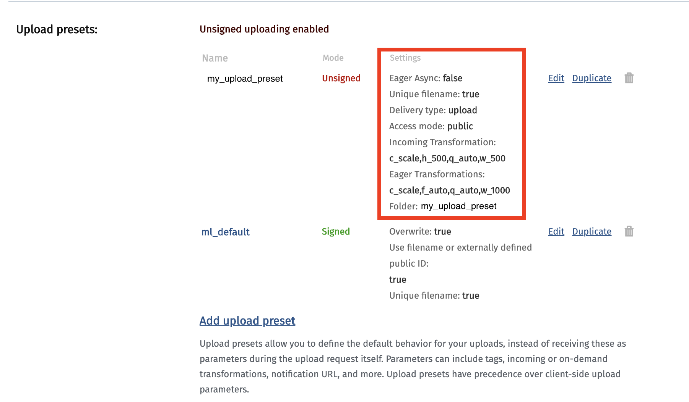

Before beginning, let's paint a picture: you're building a website with a form. In that form, you're asking your users to upload some files. Let's say it's a profile picture. Instead of storing that file on your server or in your database, you want to host it somewhere.

You've heard good things about Cloudinary, so you decide that's where you'll put it.

With those decisions out of the way, how do you actually go about setting up a form to accept images and sending them off to Cloudinary and making it available for our form submission?

That's exactly what we'll cover in this post.

## What's Covered

In this walk through, I'll cover how to upload an image to Cloudinary using a direct API call from within a form.

### Pre-Requisites:

If you're trying to follow along or want to use the information below, it'd help if you had a few things:

1. A Cloudinary account
2. [A configured upload preset that accepts unsigned requests](https://support.cloudinary.com/hc/en-us/articles/360004967272-Upload-Preset-Configuration).
3. An understanding of React components

### Topics covered include:

While the majority of this post is about how to make use of Cloudinary's API, we'll cover a few other topics as well. In all, this post addresses:

1. The `FormData` API<sup>[1](#footnotes)</sup><a id="fn1"></a>
2. The `<input type="file">` API<sup>[2](#footnotes)</sup><a id="fn2"></a>
3. Pulling it together to use Cloudinary's API<sup>[3](#footnotes)</sup><a id="fn3"></a>

With that preamble, let's get started!

## What's Involved: Building A Roadmap

At a high level, we can think about this as three distinct steps:

1. Create a form that accepts an image.
2. Send the image to Cloudinary for processing.
3. Await Cloudinary's response. Store waht's useful in State to be used on form submission.

### Input Type: File

Let's start at the beginning with a form component:<sup>[4](#footnotes)</sup><a id="fn4"></a>

```javascript:title="CreateItem.js"
class CreateItem extends React.Component {
    /*...*/
    handleSubmit = event => (/*...*/)
    handleImageUpload = event => (/*...*/)
    render() {
        <Form onSubmit={this.handleSubmit}>
            <label htmlFor="file">
                Image
                <input
                    type="file"
                    id="file"
                    name="file"
                    placeholder="Upload an image"
                    required
                    onChange={this.handleImageUpload}
                />
            </label>
            {/*...*/}
        </Form>
    }
}
```

This component takes advantage of the built in API for uploading files. It's not styled particularly beautifully, but it's functional.<sup>[2](#footnotes)</sup><a id="fn2"></a>

The user can select "Choose Files" and navigate their local file system.

If we wanted to restrict the file types that could be selected (we do after all, only want images), we could modify the input with an `accept` property.

When the user selects a file, it would trigger the `handleImageUpload` function which does the heavy lifting in our process.

Let's build that out now.

### Handling Uploaded Images

_Before_ we submit the form with all of our profile data, we'll have needed Cloudinary to have responded.

This means that we could either:

1. Block the submission process by sending off the form data from the file input, or
2. Handle the image upload as soon as the file's selected

The latter approach has several benefits including its simplicity (we won't need to store the file on the client for use later) and its speed (because we're processing it right away, asynchronously, we won't need to block the UI later when we submit the entire form).

As alluded to earlier, we need to send the file off to Cloudinary for processing.

So, before crafting the `POST` request, let's look at what [Cloudinary requires for direct API calls](https://cloudinary.com/documentation/upload_images#uploading_with_a_direct_call_to_the_api)

For unsigned (unauthenticated) requests, the docs say:<sup>[3](#footnotes)</sup>

> **Required parameters for unauthenticated requests**:
>
> `file` - The file to upload. Can be the actual data (byte array buffer), the Data URI (Base64 encoded), a remote FTP, HTTP or HTTPS URL of an existing file, or a private storage bucket (S3 or Google Storage) URL of a [whitelisted bucket](https://cloudinary.com/documentation/upload_images#private_storage_url) .
>
> `upload_preset` - The name of an unsigned [upload preset](https://cloudinary.com/documentation/upload_images#upload_presets) that you defined for [unsigned uploading](https://cloudinary.com/documentation/upload_images#unsigned_upload) to your Cloudinary account.

Great! Now that we know what's expected, we can craft our `POST` request and put the needed information into the body of our request.

### Storing Our Data In FormData

Javascript.info has a nice example of how we can use the `FormData` API to accomplish this task<sup>[1](#footnotes)</sup>:

```html
<!DOCTYPE html>
<body>
    <form id="formElem">
        <input type="text" name="name" value="John" />
        <input type="text" name="surname" value="Smith" />
        <input type="submit" />
    </form>

    <script>
        formElem.onsubmit = async e => {
            e.preventDefault()

            let response = await fetch('/article/formdata/post/user', {
                method: 'POST',
                body: new FormData(formElem), //highlight-line
            })

            let result = await response.json()

            alert(result.message)
        }
    </script>
</body>
```

This example sends along the _entire_ form, which is actually more than we want.

So, how can we pull _just_ the file data?

Here's one approach:

```javascript:title="handleImageUpload"
handleImageUpload = event => {
    const data = new FormData()
    const { files } = event.target
    data.append('file', files[0])
    data.append('upload_preset', 'my_upload_preset')
}
```

The `handleImageUpload` is fired on change to the input in question, which means that our `event.target` includes the file.

Using this, we can construct our _own_ `FormData` using the `append` method (alternatively we could use the `set`).

### Directly Calling Cloudinary's API

With our `FormData` ready, we now have everything we need to directly call Cloudinary's API.

An example of what that might look like is:

```diff:title="handleImageUpload"
handleImageUpload = event => {
    const data = new FormData()
    const { files } = event.target
    data.append('file', files[0])
    data.append('upload_preset', 'my_upload_preset')
+     fetch('https://api.cloudinary.com/v1_1/myCloudinaryUser/auto/upload', {
+         method: 'POST',
+         body: data,
+     })
}
```

This `imageUpload` handler is all that's necessary to save to `myCloudinaryUser`'s Cloudinary account using the upload preset configuration `my_upload_preset`.

Looking back at our Roadmap, we've finished step two: send our image to Cloudinary for processing.

### Listen For, And Store, Cloudinary's Response

We're almost done! When Cloudinary receives a new image (or video), it will save it where it's told, and then send back a payload with some useful information.

For example, using the above process, if I sent an image called `test.jpg`, I might get the following back:

```JSON:title="Sample Payload"
{
  "public_id": "my_upload_preset/lseu6fakvigm1fyvmine",
  "version": 1586725962,
  "signature": "c0be73118b92c25faab103d74e972c99943885c0",
  "width": 500,
  "height": 500,
  "format": "jpg",
  "resource_type": "image",
  "created_at": "2020-04-12T21:12:42Z",
  "tags": [],
  "bytes": 60812,
  "type": "upload",
  "etag": "c06061d059af53706a53216eda193291",
  "placeholder": false,
  "url": "http://res.cloudinary.com/myCloudinaryUser/image/upload/v1586725962/sickfits/lseu6fakvigm1fyvmine.jpg",
  "secure_url": "https://res.cloudinary.com/myCloudinaryUser/image/upload/v1586725962/sickfits/lseu6fakvigm1fyvmine.jpg",
  "access_mode": "public",
  "original_filename": "test",
  "eager": [
    {
      "transformation": "c_scale,f_auto,q_auto,w_1000",
      "width": 1000,
      "height": 1000,
      "bytes": 71742,
      "format": "jpg",
      "url": "http://res.cloudinary.com/myCloudinaryUser/image/upload/c_scale,f_auto,q_auto,w_1000/v1586725962/my_upload_preset/lseu6fakvigm1fyvmine.jpg",
      "secure_url": "https://res.cloudinary.com/myCloudinaryUser/image/upload/c_scale,f_auto,q_auto,w_1000/v1586725962/my_upload_preset/lseu6fakvigm1fyvmine.jpg"
    }
  ]
}
```

Note: In the JSON above, the `eager` key is a result of Upload Preset configuration, pictured below.

|  |
| :-------------------------------------------------------------------: |
|                      Upload Preset Configuration                      |

Armed with the knowledge of what's being returned, we can update the component's state to make the image accessible in the future.

```diff:title="handleImageUpload"
handleImageUpload = event => {
    const data = new FormData()
    const { files } = event.target
    data.append('file', files[0])
    data.append('upload_preset', 'my_upload_preset')
    fetch('https://api.cloudinary.com/v1_1/myCloudinaryUser/auto/upload', {
        method: 'POST',
        body: data,
    })
+    .then(res => res.json())
+    .then(data =>
+        this.setState({
+            image: data.secure_url,
+            largeImage: data.eager[0].secure_url,
+        })
+    )
}
```

This asynchronously processes the response from Cloudinary, converts it to JSON, and then parses the data to save the relevant pieces to state.

## Closing Thoughts

At this point, we've set up a form to accept a file, sent that file off to Cloudinary for storage, and then saved the URL to State so that upon form submission, it'll be accessible for saving along with the rest of our profile.

I'd be remiss if I didn't thank Wes Bos and his [Advanced React](https://advancedreact.com/) course for the inspiration of this course. It provided the motivation to dig into Cloudinary, a topic I'd been interested in for a while, and I can't wait to keep going by looking into the SDK and seeing what else Cloudinary offers!

## Footnotes

-   <sup>[1](#fn1)</sup> This was the first time I'd heard of the FormData API, and found [this page](https://javascript.info/formdata) quite helpful in understanding more about it and how it might be used. The [MDN page](https://developer.mozilla.org/en-US/docs/Web/API/FormData) has more on its API as well.
-   <sup>[2](#fn2)</sup> The current implementation only allows for a single photo to be uploaded. Uploading multiple files is as easy as adding a `multiple` attribute to our component, though this would require a modification to the `handleImageUpload` method as well to accommodate multiple images. To learn more, see [MDN's documentation about the `<input type="file">`](https://developer.mozilla.org/en-US/docs/Web/HTML/Element/input/file).
-   <sup>[3](#fn3)</sup> [Cloudinary offers (and encourages the use of) an SDK for uploading images](https://cloudinary.com/documentation/upload_images) which is intended to simplify things. For now, however, I'm using a standard POST request to [make a direct call to the API](https://cloudinary.com/documentation/upload_images#uploading_with_a_direct_call_to_the_api). If I migrate to the SDK in the future, I'll be sure to write on that process as well.
-   <sup>[4](#fn4)</sup> I'm using a class component for ease because of the size of the state object we'll be using, though there's nothing about this that couldn't be done in a functional component with hooks.

## Post-Script

Here's a fully functional class component combining everything from above in a NextJS application with Apollo Router.

It's a slightly different use case. Instead of a profile photo, here we're creating a new item for a store and the image is for the product.

```javascript:title="CreateItemForm.js"
import React from 'react'
import { Mutation } from 'react-apollo'
import Router from 'next/router'
import gql from 'graphql-tag'
import Form from './styles/Form'
import ErrorMessage from './ErrorMessage'

export const CREATE_ITEM_MUTATION = gql`
    mutation CREATE_ITEM_MUTATION(
        $title: String!
        $description: String!
        $price: Int!
        $image: String
        $largeImage: String
    ) {
        createItem(
            title: $title
            description: $description
            price: $price
            image: $image
            largeImage: $largeImage
        ) {
            id
        }
    }
`

export class CreateItem extends React.Component {
    constructor(props) {
        super(props)
        this.state = {
            title: '',
            description: '',
            image: '',
            largeImage: '',
            price: 0,
        }
    }

    handleChange = event => {
        const { name, type, value } = event.target
        const val = type === 'number' ? parseFloat(value) : value
        this.setState({ [name]: val })
    }

    handleSubmit = async (event, createItem) => {
        // prevent native form submission
        event.preventDefault()
        // create the item on the data base
        const res = await createItem()
        // redirect to the new item's page
        Router.push({
            pathname: '/item',
            query: { id: res.data.createItem.id },
        })
    }

    handleImageUpload = event => {
        const data = new FormData()
        const { files } = event.target
        data.append('file', files[0])
        data.append('upload_preset', 'my_upload_preset')
        fetch('https://api.cloudinary.com/v1_1/myCloudinaryUser/auto/upload', {
            method: 'POST',
            body: data,
        })
            .then(res => res.json())
            .then(file =>
                this.setState({
                    image: file.secure_url,
                    largeImage: file.eager[0].secure_url,
                })
            )
    }
    render() {
        return (
            <Mutation mutation={CREATE_ITEM_MUTATION} variables={this.state}>
                {(createItem, { loading, error }) => (
                    <Form onSubmit={() => this.handleSubmit(event, createItem)}>
                        <ErrorMessage error={error} />
                        <fieldset disabled={loading} aria-busy={loading}>
                            <label htmlFor="file">
                                Image
                                <input
                                    type="file"
                                    id="file"
                                    name="file"
                                    placeholder="Upload an image"
                                    required
                                    onChange={this.handleImageUpload}
                                />
                            </label>

                            <label htmlFor="title">
                                Title
                                <input
                                    type="text"
                                    id="title"
                                    name="title"
                                    placeholder="Title"
                                    required
                                    onChange={this.handleChange}
                                    value={this.state.title}
                                />
                            </label>

                            <label htmlFor="price">
                                Price
                                <input
                                    type="Number"
                                    id="price"
                                    name="price"
                                    placeholder="Price"
                                    required
                                    onChange={this.handleChange}
                                    value={this.state.price}
                                />
                            </label>

                            <label htmlFor="description">
                                Description
                                <textarea
                                    id="description"
                                    name="description"
                                    placeholder="Description"
                                    required
                                    onChange={this.handleChange}
                                    value={this.state.description}
                                />
                            </label>
                            <button type="submit">Submit</button>
                        </fieldset>
                    </Form>
                )}
            </Mutation>
        )
    }
}
```
