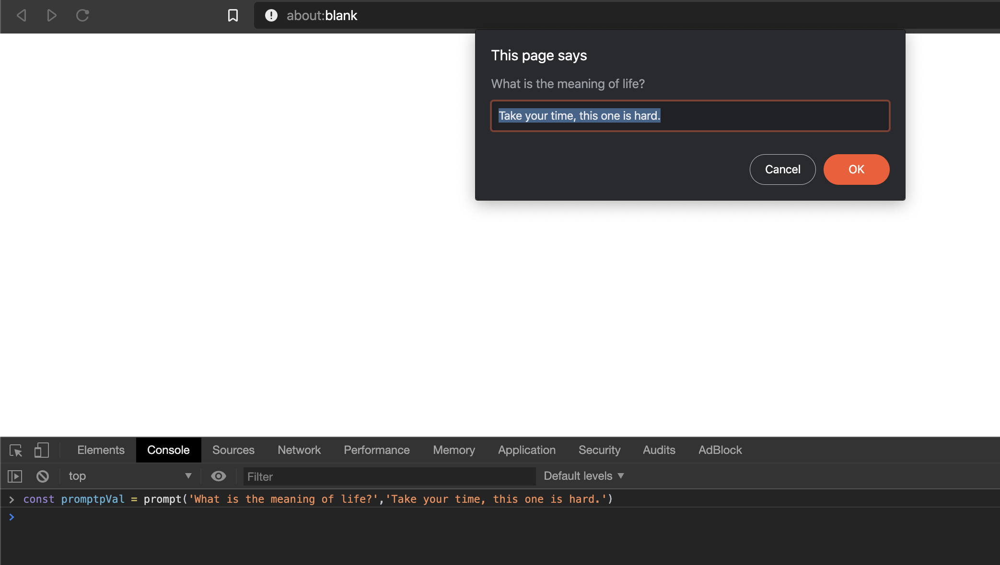

# Javascript Pop Up Boxes
For a while now I've known about Alerts. They're the shouting from the rooftop equivalent of Javascript. Instead of simply logging some output, an Alert creates a popup that must be dismissed.

What I had no idea about, however, was that it's not the only type of popup in Javascript. In fact, there are three:
1. Alert
2. Confirm
3. Prompt

Each will create a popup, however, the latter two will return values based on the user's action.

All of these popups are part of the Window API, so in most cases, they can be invoked directly.

## Confirm
Similar to the `alert`, the `confirm`, takes a single string as it's argument.

Unlike `alert`, however, the `confirm` _returns_ values - true if confirmed, false if not. (These results are achievable from the keyboard with the use of the `return` and `esc` keys.)


## Prompt
Let's look at the `prompt` now.  Like the `confirm`, `alert` returns values. However, the value returned is what is in the Prompt's input box when confirmed (okay).

If it's not confirmed, the prompt will return `null`.

A prompt takes two arguments - the first is the prompt itself, and the latter is the default value.
```javascript
const promptVal = prompt('What is the meaning of life?','Enter your response here')
```

The second argument is optional, but can be used to pre-fill the prompt's input box.



Once you enter an answer - if you press "Ok", the prompt will return the text from the input. (Here, [the answer, of course, is 42](https://www.independent.co.uk/life-style/history/42-the-answer-to-life-the-universe-and-everything-2205734.html))


Pressing `cancel` would have returned `null`.

## Conclusion
So, file this one under TIL - I had no idea that alert wasn't alone. I'd never had a reason to explore the others, and even more curiously, I'd never thought about the return values!

Another tool (or two) in the tool chest. All in a day's work. Carry on.
