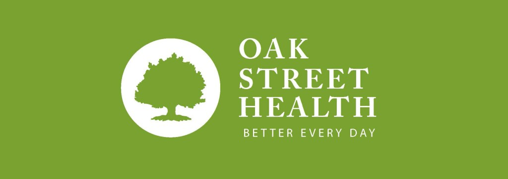
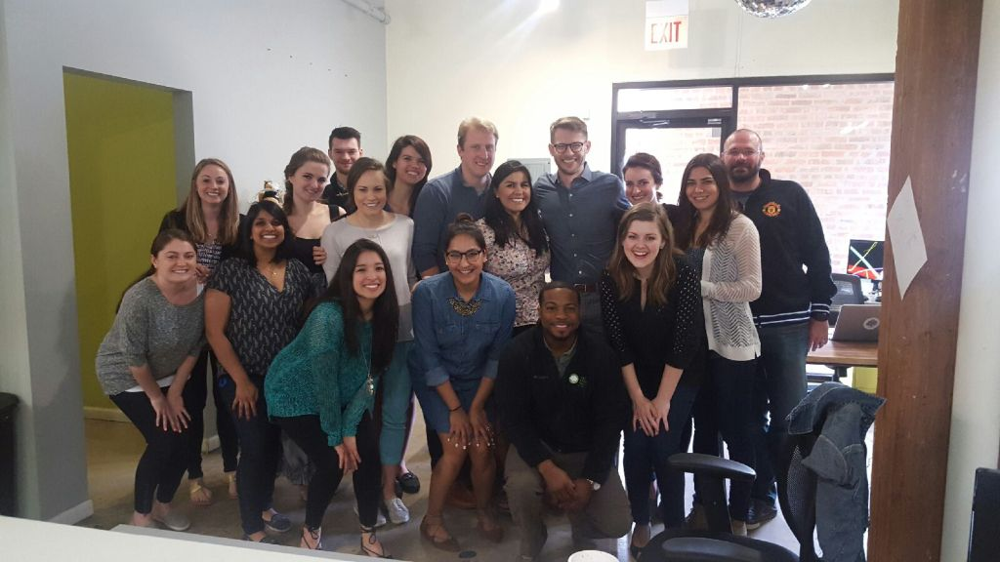

This morning I woke up for the first time in nearly three years without something that had become a core part of my identity.

Yesterday, I was an Oaky. I worked for one of the most innovative health care start ups in the country. More than that, it was an integral part of my self-definition for nearly three years. I define myself by my work. Possibly too much. But during my time at Oak Street, that was a blessing.

It’s not that everything was roses. Any company that grows from 10 to 600 in 36 months is going to experience growing pains. But when you have that team around you, a team that’s dedicated to helping — our patients and one another, it’s easy to have faith that it’s going work out.

I am leaving Oak Street filled with fond memories, incredible friendships, and stretch experiences which will continue to shape me for years to come.

Today, I’m self-employed. I’m realizing a dream years in the making. This past week was one of the most surreal of my life. Nearly every conversation I had was about what life was going to be like after leaving Oak Street. The outpouring of support that I received from friends and colleagues was amazing. I have had so many people offer help.

I learned so much at Oak Street, from the nitty gritty of running a business to leading teams and so much more. I found mentors and role models. I soaked up everything I could. Now, I have the opportunity to put into practice what I’ve learned and continue to grow.

#BetterEveryDay

|                                     |
| :------------------------------------------------------: |
| _A few of the wonderful friends I've made at Oak Street_ |
