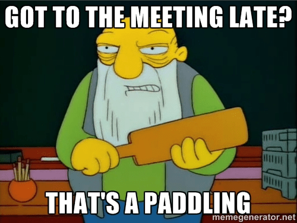

In his brilliant book on management and leadership, [The Hard Thing About Hard Things](https://www.amazon.com/Hard-Thing-About-Things-Building/dp/0062273205/ref=sr_1_1?ie=UTF8&qid=1496935555&sr=8-1&keywords=the+hard+thing+about+hard+things), Ben Horowitz covered a lot of ground. Three years later, I still think frequently about the rule they implemented at AndreesonHorowitz related to meetings.

The rule is one of my favorite examples of a firm conscientiously aligning incentives through design. Simply put, the partners committed that if they were late to a meeting, they would pay $10 for each minute they were tardy. This did several things, but most importantly in my mind, it reinforced that as a firm they were there to serve their customers: the companies they invested in. The rule implies that the time of any one they had a meeting with was worth $600/hour. That's a pretty strong signal that you value who you're meeting with and one of the myriad reasons AndreesonHorowitz has a reputation for being a great firm for founders.

What would happen if we adopted this rule for ourselves? If we viewed the meetings we set with our self as worth \$600/hour?

My guess is one of two things would happen (possibly both):

First, you would stop being late to meetings with yourself as not many people can afford to pay the fees associated with a \$1.2 million annual salary.

Secondly, you would think before scheduling a meeting and decide if it was worth the time. Putting meetings on a schedule is easy. Ensuring that they're valuable for all participants is decidedly more difficult. Even if it's a meeting with yourself, adopting a rule that values a meeting at \$600/hour is going to make sure that you're not wasting your time.

I've spent the better part of the year thinking about how time works and how we interact with it. On the one hand, a career is really long to the point that until we're in our mid-to-late 60s, we can still start a new career (quick math: ~2,000 working hours a year would take ~5 years to reach the 10,000 hour mark). On the other, time is the most precious resource and how we spend it says a lot about who we are.

It's worth evaluating with some frequency if we're spending our time productively.
