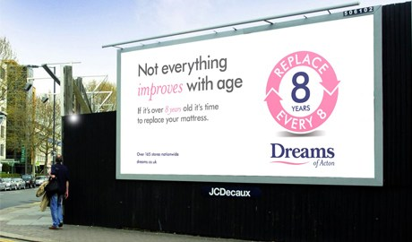

"For best results, mattresses should be replaced every 8 years" -- I recently saw an ad with this copy in a window of a mattress store near my home.

My immediate reaction was amazement at my ignorance. I had no idea what the useful life of a mattress is or should be. I've been sleeping on the same mattress for the better part of a decade and had never thought about changing it. As a family, we own mattresses that are older than I am, sometimes by a lot. Mattresses always seemed like a multi-generational durable good to me.

While it didn't immediately convince me otherwise, the ad at least forced me to reconsider my perspective and question the biases I'd accumulated over the years. It also anchored me on a new time frame - 8 years, considerably shorter than the 80 I'd been used to.

Once I had come to terms with my ignorance, I started working through the problem with a healthy dose of skepticism as my spidey-sense started tingling in response to the ad's apparent bias and conflicts of interest, triggered in part to its reminiscence to the [fictional story](http://archive.fortune.com/magazines/fortune/fortune_archive/1999/10/11/267035/index.htm) that an ad executive doubled shampoo sales by adding the word repeat to its instructions of "lather and rinse" which doesn't exactly engender warm, fuzzy feelings as a consumer.

# What is bias and should we care?

Bias tends to be viewed as a dirty word. We're taught to view biases with skepticism as they can cloud perspective and often result in undesirable outcomes.

We forget that a bias is really an inclination toward a particular set of inclinations, feelings, and opinions and focus instead on the subset of biases that are preconceived or unreasoned.

By the broader definition, however, the mattress industry is the most likely source of **useful** biases related to mattress longevity and as a result, listening to them would be in my best interest.

Not only is it their business to know how frequently a mattress should be replaced, but the scope and volume of experiences a mattress store or company has dwarfs any possible perspective of an individual consumer; where the mattress store will deal with hundreds, if not thousands of customer interactions in a given year, most people have a handful of experiences over the course of their lifetime.

Consumer reports may be a good alternative to the industry source, however, while they may be able to compete on breadth, it's unlikely that they would have the richness of perspective on the longevity of a mattress -- it's much more expensive to test how a mattress(es) will feel after 8 years than it is to sleep in 100 mattresses over 100 nights.

In contrast, the International Sleep Products Association started the Better Sleep Council "devoted to educating the public about the critical relationship between sleep, good health and quality of life, as well as the value of the mattress and sleep environment in the pursuit of a good night’s sleep." The BSC is also the source of the recommended replacement rate for mattresses - [though the BSC's is actually seven to ten years](http://bettersleep.org/mattress-education/replacing-a-mattress/). Turns out, [not everyone buys that advice](http://restonic.com/blog/mattress-myths-4876).

So, while the mattress industry may be best situated to know what a mattress's useful life is on average, it's not guaranteed that the industry won't abuse that trust to encourage sales. Proceed with caution.

# What about the financial component?

It's also worth commenting on the clear financial benefit to the mattress store if they can get folks to follow their advice. While this may be cause to hesitate, the store is not hiding any benefit and buyers should be aware that the store is being compensated for their advice with each purchase.

Paying for advice is also not rare. It's common practice to pay for advice from those who are more knowledgeable - accountants, lawyers, consultants, financial advisers\*, and doctors all come to mind. In each of those cases, we pay for experience and perspective - the mattress store is not that different, though most sales people at mattress stores are not members of guilds like many of the industries mentioned.

(\*Related: It's worth understanding the difference between the fiduciary and suitability standards that govern different types of financial advisers and making sure you're getting the advice you think you are.)

# Parting thoughts

I'm not running out to buy a mattress. I'm not convinced I need to. Still, I appreciated the ad's reminder that advice should be considered critically and that just because there are biases embedded does not automatically disqualify it from containing useful lessons.

Experience and expertise have real economic value that's worth seeking out prior to making decisions -- and when that advice runs counter to any biases you may have, it's similarly useful to reflect on why.

That's a lesson worth sleeping on.
