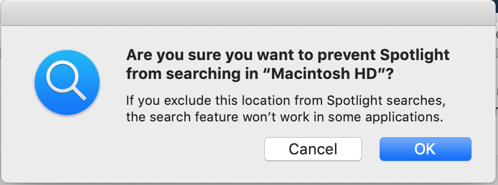

Recently, Spotlight had been acting up.

For example: When I search for Spotify (an app I use every day), it wouldn’t show up. Instead I’d get Spotlight - or if I typed out the entire query, I’d get emails where I mentioned Spotify. The app was not present.

I rely on Spotlight to open my apps (because who has time to actually open the App launcher and I don’t have an assistant like Alfred).

The nice folks over at [MacIssues](http://www.macissues.com/2014/12/12/how-to-determine-when-your-spotlight-index-needs-to-be-rebuilt/) documented a few other instances of when you might need to rebuild the index for Spotlight. Their list includes a few different ways in which Search can break down:

1. You search for calc and Calendar is the first result (and Calculator may or may not even be one of the results)
2. Missing files: You cannot find a file you know exists regardless of how its searched
3. Improper priorities: If you use Spotify every day but it shows up below an email you sent 6 years ago with an offhand reference to the service.
4. Duplicates: Assuming there’s not an actual duplicate file… this would be indicative of a problem.

Which brings us to the quick (and easy) way to have Spotlight reindex. All in - takes < 1 minute.

1. Open System Preferences
2. Go to Spotlight
3. Open the Privacy Tab
4. Click the `+` button and select your `Macintosh HD` (This can be selected via the path on the left or with the shortcut `Cmd + Shift + c`
5. You may get a warning to confirm the choice. Select Ok.
   
6. Now remove `Macintosh HD` from the list using the `-` sign.

Spotlight should now begin reindexing (which takes a few minutes) and working properly.

Note: Services like CleanMyMac, which I have and find generally useful, are suspected as a cause of issues with Spotlight according to some folks.

Additional resources:
[SpotlightPrivacyList | MacIssues](https://www.macissues.com/2014/12/12/how-to-determine-when-your-spotlight-index-needs-to-be-rebuilt/spotlightprivacylist/)
[Spotify doesn’t show up in Spotlight - Apple Community](https://discussions.apple.com/thread/7356551)
