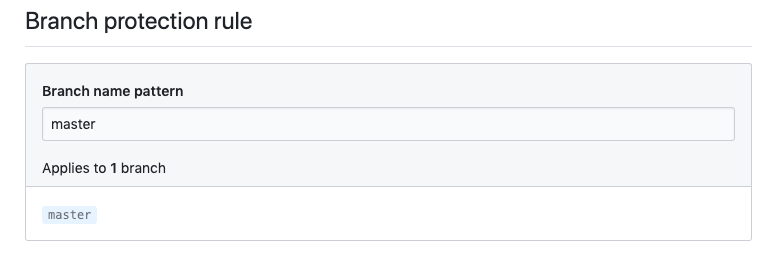

I use Netlify to manage the deployment of my site.

One of the things I love about Netlify are the checks they run against each branch to make sure nothing’s breaking.

Checks are great and all, but I’d still managed to merge broken code by not waiting for them to finish.

To avoid that situation in the future, I wanted to use Github’s Branch Protection rules.

GitHub has a documentation walking you through the steps (here: [Enabling required status checks - GitHub Help](https://help.github.com/en/articles/enabling-required-status-checks)).

My issue was that I didn’t understand what the branch name pattern referred to, and there was no tooltip.

Through trial and error, it turns out this is a Regex pattern that you can use to apply the rule to specific branches.

So, if you name all feature branches `feature/xxx` then, you could use that, or `bugs/yyy` if they have a different set of checks / requirements.

This is really handy - unfortunately, I didn’t read closely enough and I thought it was just a label for my rule because it kept not saving. My first few attempts were "Netlify Rule" or something like it, which is not a valid git branch name and so Github simply rejected the rule.

The more you know!
