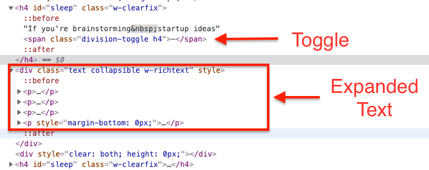

Recently I heard about Julian.com and specifically about the design of the manuals the owner, Julian Shapiro writes.

One of the things that he includes are little expander buttons (see the `+`/`-` below) that will expand to information if you opt-in.


I love that. Julian provides the information that he deems minimally sufficient to understand the topic and then allows readers to opt into other information that may be relevant to them.

Digging into his particular implementation, it appears that he’s using a `<span>` tag with a click handler to manage this transition.<br/>

As I noted in [Buttons Without Style](../../2019-06-05/styleless-buttons-a11y), putting a click handler on a `<div>` is not ideal for accessibility. So, while I love the effect, I was wondering if there was a more accessible way to handle the implementation.

# Seeking Options: Finding Details

Other options of course include styling a `<button>`, but in my research, I stumbled upon an HTML tag I’d never used before: the `<details>` tag.

The default may not be as stylish as Julian’s `<div>` but it’s semantic HTML, which makes it attractive to me. The API has three basic parts and the MDN article notes several opportunities with regards to styling that I’ll be experimenting with in the near future. <sup>1</sup>

The three main features of the API are:

1. The Details Tag - This wraps the Summary and the hideable content.
2. The Summary Tag - This is what you _always_ show - it’s the top level label.
3. The Indicator - This is not a distinct tag, but is separately style able. The default is a triangle, e.g., `▶︎`.

# Example of the `<details>` tag in practice

<details>
<summary> Click Me To See More </summary>

<h1>How To Expand Your Content</h1>
<p>Wrap what you want to expand in a Details tags</p>

<code> Even include code blocks</code>

</details>

The implementation is relatively straightforward - requiring only a few lines of HTML. Below is how I implemented it.

```html
<details>
    <summary> Click Me To See More </summary>

    <h1>How To Expand Your Content</h1>
    <p>Wrap what you want to expand in a Details tags</p>

    <code> Even includ code blocks</code>
</details>
```

# Adoption

It’s worth noting that the `<details>` tag is _not_ supported in Internet Explorer or Edge.

## Footnotes:

1.  [Details: The Details disclosure element | MDN`](https://developer.mozilla.org/en-US/docs/Web/HTML/Element/details)
