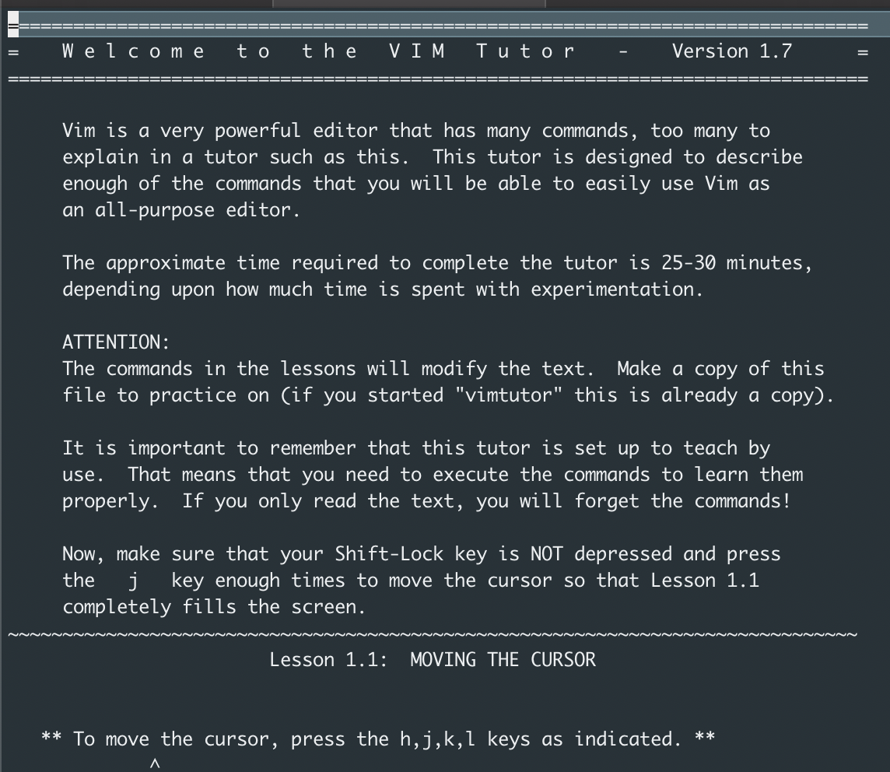

If you have `vim` already installed, you can get an interactive walk-through using the `vimtutor`.

To launch `vimtutor`, open your shell and type in the command `$ vimtutor`.

It’s a very accessible tutorial, yet teaches the hardest thing to learn almost right away — how to quit!

Noting this because googling "vim tutorial" yields many sites with their own, but `vimtutor` is always with me - so why not take advantage?
