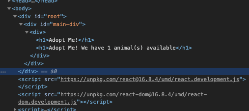

Recently, I walked through building a basic React App.<sup>1</sup> In retrospect, I could make it _even more_ basic by removing _any_ package managers, bundlers, or other tooling.

NB: This exercise is adapted from Brian Holt’s Frontend Masters course (which is also where I borrowed the styling from). He’s posted all of the course notes on Github too.<sup>2</sup>

To get started, all we need is an `index.html` and a `style.css`.

My project looks like this (the `src` directory is just for organization):

```shell
.
└── src
    ├── index.html
    └── style.css
```

Want to see an entire React app in one file?

```html
<!DOCTYPE html>
<html lang="“en”">
    <head>
        <meta charset="UTF-8" />
        <meta
            name="“viewport”"
            content="width=device-width, initial-scale=1.0"
        />
        <meta http-equiv="X-UA-Compatible" content="ie=edge" />
        <title>Adopt Me</title>
        <link rel=“stylesheet” href=“./style.css”/> // import styles
    </head>
    <body>
        <div id="root">not rendered</div>
        <script src="https://unpkg.com/react@16.8.4/umd/react.development.js"></script>
        // import react
        <script src="https://unpkg.com/react-dom@16.8.4/umd/react-dom.development.js"></script>
        // import react-dom to actually mount react
        <script>
            const App = () =>
                React.createElement(
                    'div', // the element that’s rendered
                    { id: `main-div` }, // the props that are passed to the rendered element
                    React.createElement('h1', {}, 'Adopt Me!') // the children of our element
                ) // our current entire app
            ReactDOM.render(
                React.createElement(App),
                document.getElementById('root')
            )
        </script>
    </body>
</html>
```

Voilá. We have our app rendering!


So, what’s actually happening here? We’re using pure React with the `createElement` method featured prominently. In fact, we use it three times:

1. To create the `App` component
2. To create a `div`
3. To create an `h1`

`createElement` takes three arguments (the latter two are optional):

1. The component to render
2. Any props and attributes to pass through to the component
3. Any children of the component.

## Passing A Sub Component

So far, we don’t have a very _interesting_ application however. How could we extend it?

Let’s start with a child that actually receives props.

```javascript
<script>
  const Header = (props) => {
    return React.createElement("h1", {}, "Adopt Me! We have ${props} animal(s) available")
  }
  const App = () => React.createElement(
    "div",
    {id: `main-div`},
    React.createElement("div", {}, React.createElement(Header, {value: 1}))
  )
  ReactDOM.render(React.createElement(App), document.getElementById('root'))
</script>
```

What’s interesting here is to see _how_ we simply repeat the pattern, though this time, the composite component, `Header` is receiving props (`value:1`) which we see in the console.


## Multiple Children

Since a div can have multiple children, if we want to pass more than one, just list them in an array.

```javascript
<script>
  const Subheader = (props) => React.createElement(“h1", {}, `We have ${props.value} animal(s) available`)

  const App = () => React.createElement(
    "div",
    { id: 'main-div' },
    React.createElement("div", {},
      [
         React.createElement("h1", {}, `Adopt Me!`),
         React.createElement(SubHeader, { value: 1 })
      ])
  )

  ReactDOM.render(React.createElement(App), document.getElementById('root'))
</script>
```




## Extracting React From The HTML

This isn’t very easy to manage, however. Let’s pull these pieces apart so we’re not writing Javascript directly in our HTML.

We can start by adding an `App.js` file to the `src` directory.

```shell
.
├── package.json
└── src
    ├── App.js
    ├── index.html
    └── style.css
```

Copy the Javascript code (everything in the `<script>` tag) to `App.js`

Update the `<script>` tag to reference the `App.js` as its source.

```html
<script src="./App.js"></script>
```

That’s it. We’ve now rendered a React App without `npm`, without `webpack`, and without embedding the Javascript in the HTML.

At this point we’ve written a _pure_ React app. No tools. No npm. No bundles. We could keep going like this too. Though, I find the tools helpful. For more on that see my other walkthrough, Getting A Basic React App Up and Running<sup>1</sup>.

# Resources

-   <sup>1</sup> [Getting a Basic React App Up And Running | /_ Code Comments _/](../../2019-09-08/tutorial-basic-react-app/)
-   <sup>2</sup> [Complete Intro to React v5](https://btholt.github.io/complete-intro-to-react-v5/intro)
